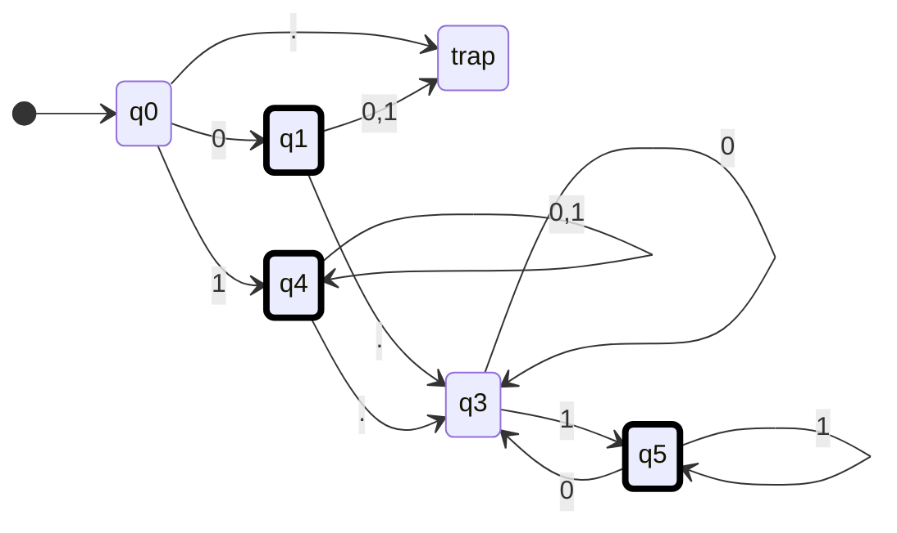
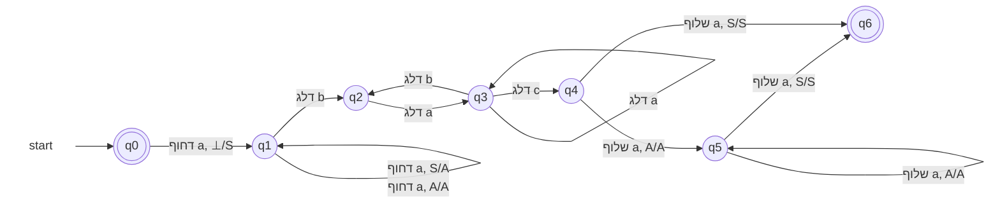
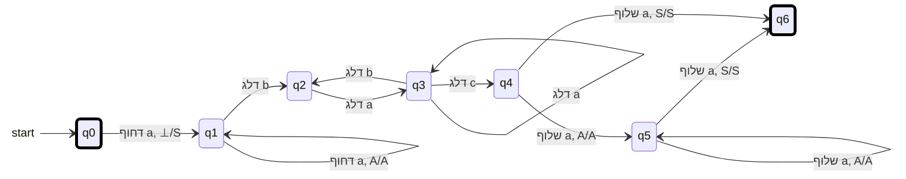
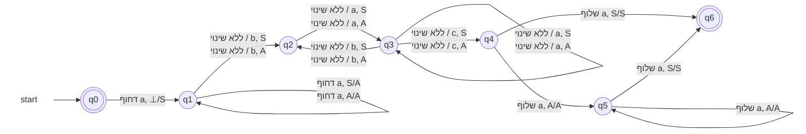
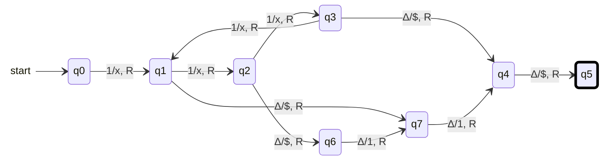
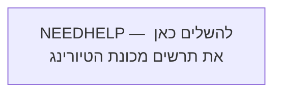

# מטלת הגשה מס' 5 — מסכמת

**קורס:** מודלים חישוביים  
**מורה:** צורי ויקטוריה  
**תאריך אחרון להגשה:** 7.07.2026

## הנחיות לביצוע המטלה

<strong>רפלקציה על ההשתלמות</strong>

ויקטוריה מלמדת בצורה ברורה ומסודרת ומלווה את הקורס בחומרים מעולים ובסרטונים. אלו ללא ספק יאפשרו לי לחזור לחומרים ולדייק את ההבנה.

### האם אני מתכוון/ת ללמד את היחידה בשנת הלימודים הבאה?

  לא אלמד בשנה הבאה. אני מעדיף להיות בשל יותר, ולא לנטוש את הוראת תמ"ע בשנה הקרובה.
### כיצד ההשתלמות תרמה לפיתוח המקצועי שלי?

  ההשתלמות תאפשר לי ללמד בעתיד, והכירה לי תחום חדש.

### אילו מיומנויות חדשות למדתי בהשתלמות, וכיצד איישם אותן בהוראתי בעתיד?

  למדתי תחום חדש בו ניתן ללמד לוגיקה. למדתי היכן נמצאים מודלי שפה כיום ביכולת לעזור בפתרון בעיות / בקרה / וכתיבת תכנים במודלים. עוד במטלה הראשונה או השניה ראיתי שניתן לרנדר יחסית בקלות במרמייד, וגם להמיר פתרון בכתב יד למרמייד שעובד. בהמשך ראיתי שיש תמיכה מפורשת ב-`stateDiagram-v2` אפילו שרוב הדיאגרמות כאן הן עדיין מסוג אחר. ראיתי **שבשימוש נכון** המודלים יכולים לסייע ולפרט לתלמיד היכן הטעות שלו, ושבסך הכל הפתרונות שלי בשאלות אותן הגשתי הם טובים אבל עדיין לא מושלמים. 
  ==בנוסף למדתי בהגשת המטלה המסכמת שהמודלים משתמשים במהלכי אפסילון שאינם מותרים לשימוש בבגרות,== ואם התלמיד לא ער לכך ואינו מנחה את המודל, הוא יקבל פתרונות שאינם קבילים. נובע מכך שרצוי להכין `GEM` לצורך סיוע תקין בפתרונות (או שמורה יכול להיעזר בעובדה שתלמידים יפספסו את הדקויות הללו, כדי לזהות העתקות)

  על כל פנים הגישה שלי שצריך לבחון יותר עומדת בהינה.

### נקודות לשימור או לשיפור באופן העברת ההשתלמות.

  בסוף ההשתלמות נפתח קלאסרום, ואני מצטער שלא היה קלאסרום לאורך כל ההשתלמות.
  נקודה לשיפור לעצמי - להפחית עומסים כדי לא להפסיד מפגשים. לא רואה שזה קורה כרגע. ולכן דווקא הפתרון של לעבוד את ההשתלמות שוב בעתיד היא פתרון.

---

<strong>שאלה 1 — אוטומט סופי דטרמיניסטי לא מלא</strong>

בנו **אוטומט סופי דטרמיניסטי לא מלא** המקבל את שפת כל המילים מעל האלפבית

$$
\Sigma = \{0,1,\texttt{.}\}
$$

המהוות מספרים בינאריים, עם נקודה עשרונית או בלעדיה, כאשר:

1. אם מופיעה נקודה, חייבת להיות לפחות ספרה אחת לפניה ולפחות ספרה אחת אחריה.
2. אם מופיעה נקודה, אסור שהמספר יסתיים ב־`0` — כלומר, לא תופיע בסופו ספרת `0` חסרת משמעות.
3. אסור שיופיעו אפסים מובילים.

### דוגמאות

| מילים השייכות לשפה | מילים שאינן שייכות לשפה |
|---|---|
| `0` | `0.0` |
| `10100` | `00101` |
| `0.101` | `1010.110` |
| `0.011` |  |
| `1001` |  |
{: .table-en}

### אזור עבודה — תרשים האוטומט

#### נסיון ראשון

#### האם האוטומט שלי נכון
כן, **מבחינת השפה שהאוטומט מקבל — הפתרון שלך תקף**.

המצבים אצלך מייצגים נכון את המצבים הלוגיים:

| מצב  | משמעות                                                                         |
| ---- | ------------------------------------------------------------------------------ |
| `q0` | תחילת הקלט — עדיין לא נקראה ספרה                                               |
| `q1` | נקרא בדיוק `0` בתחילת המספר                                                    |
| `q4` | החלק השלם התחיל ב־`1`, ולכן ניתן להמשיך עם `0` או `1`                          |
| `q3` | נקראה נקודה, ועדיין לא נקראה ספרה אחריה, או שהספרה האחרונה אחרי הנקודה היא `0` |
| `q5` | נמצאים אחרי הנקודה והספרה האחרונה היא `1`                                      |

### למה מצבי הקבלה נכונים?

* `q1` מקבל את המספר `0`.
* `q4` מקבל מספרים שלמים שמתחילים ב־`1`, כגון `1`, `10100`.
* `q5` מקבל מספרים עם נקודה שהספרה האחרונה שלהם היא `1`.

`q3` אינו מקבל, ובצדק, משום שהוא מייצג:

* מספר שמסתיים מיד אחרי הנקודה: `101.`
* או מספר שהחלק השברי שלו מסתיים ב־`0`: `101.110`

### בדיקה מול הדוגמאות

* `0` — מסתיים ב־`q1` ✅
* `10100` — מסתיים ב־`q4` ✅
* `0.101` — מסתיים ב־`q5` ✅
* `0.011` — מסתיים ב־`q5` ✅
* `00101` — מ־`q1` הקריאה של `0` נוסף מובילה לדחייה ✅
* `0.0` — מסתיים ב־`q3`, שאינו מקבל ✅
* `1010.110` — הספרה האחרונה היא `0`, ולכן מסתיים ב־`q3` ✅

## ההערה היחידה: מצב המלכודת

השאלה מבקשת **אס״ד לא מלא**, ולכן אין צורך לצייר את מצב `trap`.

במקום:

* מעבר מ־`q0` על `.`
* מעברים מ־`q1` על `0,1`

אפשר פשוט **לא להגדיר את המעברים האלה**. כאשר האוטומט ינסה לקרוא אותם, הוא ייתקע והמילה תידחה.

לכן הגרסה הנקייה יותר תהיה:

| מצב  | `0`      | `1`      | `.`      |
| ---- | -------- | -------- | -------- |
| `q0` | `q1`     | `q4`     | לא מוגדר |
| `q1` | לא מוגדר | לא מוגדר | `q3`     |
| `q4` | `q4`     | `q4`     | `q3`     |
| `q3` | `q3`     | `q5`     | לא מוגדר |
| `q5` | `q3`     | `q5`     | לא מוגדר |

מצבים מקבלים:

$$[
F={q1,q4,q5}
]$$

כלומר: **הרעיון והמעברים שלך נכונים; מומלץ פשוט למחוק את מצב המלכודת ואת המעברים אליו, כדי שהאוטומט יהיה בבירור אס״ד לא מלא.**

**לא השתכנעתי וגם אני חושב שהפתרון שלי יצא יותר יפה מהמרמייד** אבל אולי זה בגלל שאני רגיל שאנחנו בונים את המודלים משמאל לימין

---

<strong>שאלה 2 — שפה, רגולריות ואוטומט מחסנית</strong>

נתונה השפה:

$$
L = \left\{
 a^{i_1} b a^{i_2} b \dots c a^{i_n}
 \;\middle|\;
 n \ge 2;
 \ \forall k\ (1 \le k \le n),\ i_k \ge 1;
 \ i_1 = i_n
\right\}
$$

### הסבר לשפה

- אוסף כל המילים מעל האלפבית $\{a,b,c\}$ המכילות רצפים של `a`, כאשר `b` מפריד בין רצף לרצף.
- מספר אותיות ה־`a` ברצף הראשון שווה למספר אותיות ה־`a` ברצף האחרון.
- לפני הרצף האחרון מופיע `c` במקום `b`.

> **הערה חשובה:** רצף של `a` חייב להכיל לפחות `a` אחת.

### דוגמאות

| מילים השייכות לשפה | מילים שאינן שייכות לשפה |
|---|---|
| `abaaca` | `abca` |
| `aaabacaaa` | `ababa` |
|  | `abaacaa` |
{: .table-en}

### סעיפים

{: .alefbet}

1. מהי המילה הקצרה ביותר בשפה? נמקו את קביעתכם.
 המילה הכי קצרה היא abaca מפני שמוגדר שבכל אחת מקבוצות ה-a חייב להיות לפחות אחד. כלומר לא יתכן aca
1. האם השפה רגולרית? הוכיחו.
    השפה aⁿbⁿ אינה רגולרית כי לא ניתן לבנות אוטומט סופי כאשר דרושים אינסוף מצבי השוואה לאינסוף האורכים השונים.

    וחומר ששפה שבה יש השוואה בין כמות a בהתחלה לכמות a בסוף, תסבול מאותה הבעיה. 

    הערה: עצם זה שהשאלה מבקשת אוטומט מחסנית מהווה רמז עבה לכך שהשפה אינה רגולרית (זה כמובן לא טיעון קביל)
1. בנו אוטומט מחסנית לשפה.

### אזור עבודה — אוטומט מחסנית

הפתרון שלך כמעט מושלם ומיישם בצורה מצוינת את כללי הטקס של משרד החינוך! הקפדת להימנע ממעברי אפסילון בסוף המילה, והשתמשת נכון בסימן `S` כדי לסמן את ה-`a` הראשון במחסנית ולקזז אותו עם ה-`a` האחרון.

עם זאת, יש למודל שלך נקודת תורפה אחת (באג קטן) שמונעת ממנו לקבל את כל המילים בשפה.

### הבעיה: מה קורה כשיש רק `a` אחד ברצף? ($i_1 = 1$)

כפי שציינת בעצמך בפתרון לסעיף א', המילה הקצרה ביותר בשפה היא `abaca`.
בוא נריץ את המילה הזו על האוטומט שציירת:

1. **קריאת `a` ראשון:** מתחילים ב-`q0`, קוראים `a`, דוחפים `S` ועוברים ל-`q1`. (המחסנית מכילה כעת `S` מעל `⊥`).
2. **קריאת `b`:** קוראים `b`, מדלגים על המחסנית, ועוברים ל-`q2`.
3. **קריאת `a` אמצעי:** קוראים `a`, מדלגים על המחסנית, ועוברים ל-`q3`.
4. **קריאת `c`:** קוראים `c`, מדלגים על המחסנית, ועוברים ל-`q4`.
5. **קריאת `a` אחרון (מצב `q4`):** אנחנו ב-`q4` עם `a` בקלט, ובראש המחסנית מחכה לנו `S` (כי היה רק `a` אחד ברצף הראשון).
**כאן אנחנו נתקעים.** המעבר היחיד שיוצא מ-`q4` דורש שיהיה `A` בראש המחסנית (`a, A/A שלוף`). אין מ-`q4` מעבר שמאפשר לשלוף `S`, ולכן המילה התקינה `abaca` תידחה.

**התיקון:**
כדי לטפל במצב שבו $i_1 = 1$ (ולכן $i_n = 1$), צריך להוסיף מעבר ישיר מ-`q4` ל-`q6` על הקלט `a` עם שליפה של `S`.

---

### הערה לגבי הרישום "דלג"

השימוש במילה "דלג" (Skip) למעברים ב-`q1, q2, q3` הוא מאוד ברור אינטואיטיבית, אבל כדאי לוודא שהמורה מקבלת את הניסוח הזה במבחנים. במודל פורמלי של אוטומט מחסנית, המכונה *חייבת* לקרוא את ראש המחסנית בכל צעד.
בדרך כלל, כדי להגיד "אל תיגע במחסנית", כותבים מעברים מקבילים ששולפים ומיד מחזירים את אותו סימן. למשל, במקום `b, דלג` מ-`q1` ל-`q2`, מנוסח רשמי יותר היה כותב שני מעברים:

* `b, A/A` (קראנו `b`, בראש המחסנית `A`, מחזירים `A`).
* `b, S/S` (קראנו `b`, בראש המחסנית `S`, מחזירים `S`).

אם המורה אישרה את המילה "דלג" בכיתה — מעולה. פשוט שים לב לזה.

---

### תמלול ל-Mermaid (כולל התיקון)

הכנתי לך את התמלול ל-Mermaid של השרטוט שלך. **הוספתי פנימה את המעבר החסר מ-`q4` ל-`q6`** כדי שהאוטומט יהיה מושלם.

---

{: .box-note}
המעבר העצמי של `q1` על `S` נשאר בכוונה: אחרי קריאת ה-`a` הראשון עוברים מ-`q0` ל-`q1` כאשר `S` בראש המחסנית, ולכן אם הרצף הראשון מכיל `a` נוסף, צריך לדחוף `A` מעל `S`. המעבר על `A` מטפל ב-`a` השלישי והלאה.

{: .box-note}
 פרומפט: תקן את המרמייד כדי שיהיה בכתיבה מפורטת. כמו כן בגלל עימוד עברית אנגלית, המילה דחוף או שלוף או ללא שינוי חייבת להופיע בסוף במקום בהתחלה או בהתחלה במקום בסוף (הפוך מהמקום בו שמת אותה)

מעולה, הבנתי בדיוק את הבעיה! בעיות של כיווניות טקסט (RTL/LTR) במרמייד בשילוב עברית ואנגלית יכולות להיות מתסכלות.

כדי לפתור את זה:

1. **הפכתי את סדר המילים במחרוזות:** המילים `דחוף`, `שלוף` ו-`ללא שינוי` יופיעו עכשיו בתחילת המחרוזת בקוד, כך שהן ירונדרו בצד ההפוך והנכון (בהתאם למה שביקשת).
2. **פירטתי את כל מעברי ה"ללא שינוי":** החלפתי את המילה "דלג" ברישום המפורט לפי התמונה שצירפת. מכיוון שבשלבי הביניים (בזמן קריאת ה-`b`, `a` וה-`c`) במחסנית יכול להיות בראשה או `S` (אם היה רק `a` אחד בהתחלה) או `A` (אם היו כמה), הוספתי מעברים מקבילים לשני המקרים בכל מצב.

הנה הקוד המעודכן עבורך:

**שינויים שבוצעו:**

* כל רישומי ה"דלג" הוחלפו למבנה מפורט (למשל `ללא שינוי / b, S` ו-`ללא שינוי / b, A`).
* מילות הפעולה בעברית הוזזו לצד השני של המחרוזת כך שיוצגו נכון במנוע של Mermaid בהתאם לבעיית העימוד שציינת.
* כזכור מההודעה הקודמת, כללתי כאן גם את המעברים ל-`q6` על `S` מתוך `q4` ו-`q5` כדי לכסות את כל מקרי הקצה של כמות ה-`a`.

מרמייד אכן יכול להיות קצת עקשן בכל מה שקשור לסידור אלמנטים על המסך. במיוחד כשיש לולאה (Self-loop) יחד עם חצים שיוצאים ונכנסים מאותו מצב, והטקסטים ארוכים בגלל הפירוט, נוצרת התנגשות חזותית. בתור מודל AI שכותב קוד לתרשימים, אני נתקל במגבלות הרינדור האלו של Mermaid לא מעט.

{: .box-note}
פרומפט: הלולאה ב-q3 והמעבר מ-q3 ל-q4 מתנגשים - הטקסט מופיע אחד על השני. יש משהו שניתן לעשות עם זה?

### הפתרון

הדרך הפשוטה והיעילה ביותר לטפל בזה ב-Mermaid היא **להאריך את החץ** שיוצא מ-`q3` ל-`q4`.
במקום להשתמש בחץ סטנדרטי (`-->`), נשתמש בחץ ארוך יותר עם שלושה או ארבעה מקפים (למשל `---->`). הפעולה הזו לא משנה את הלוגיקה של האוטומט, אבל היא מכריחה את מנוע הרינדור של מרמייד להרחיק את `q4` מ-`q3`, מה שמשאיר מספיק "אוויר" לטקסט של הלולאה לצוף מבלי לדרוס שום דבר.

הנה הקוד המעודכן עם הריווח המוגדל (שים לב לשורה של `q3` ל-`q4`):

---

<strong>שאלה 3 — מכונת טיורינג באונרית</strong>

נתונה מכונת טיורינג המקבלת כקלט מספר שלם הכתוב באונרית, ונותנת כפלט מספר שלם הכתוב באונרית.

לפניכם קבוצת המעברים של המכונה:

| מצב נוכחי | הסימן הנקרא | מצב הבא | הסימן הנכתב | תנועה |
|---|---|---|---|---|
| `q0` | `1` | `q1` | `x` | ימין |
| `q1` | `1` | `q2` | `x` | ימין |
| `q1` | `Δ` | `q7` | `$` | ימין |
| `q2` | `1` | `q3` | `x` | ימין |
| `q2` | `Δ` | `q6` | `$` | ימין |
| `q3` | `1` | `q1` | `x` | ימין |
| `q3` | `Δ` | `q4` | `$` | ימין |
| `q4` | `Δ` | `q5` | `$` | ימין |
| `q6` | `Δ` | `q7` | `1` | ימין |
| `q7` | `Δ` | `q4` | `1` | ימין |
{: .table-en}

המצב `q5` הוא מצב מקבל.

### סעיפים

א. ציירו אוטומט מכונת טיורינג לפי קבוצת המעברים.

ב. בנו מעקב על המספר `5`.

| צעד | מצב | תוכן הסרט | מיקום הראש | המעבר שבוצע |
|---:|---|---|---|---|
| 0 | `q0` | `11111` |  |  |
| 1 |  |  |  |  |
| 2 |  |  |  |  |
| 3 |  |  |  |  |
| `NEEDHELP` |  |  |  |  |
{: .table-en}

**NEEDHELP — להוסיף שורות לפי מספר צעדי החישוב.**

ג. הגדירו את הפונקציה שמכונת הטיורינג מבצעת.

**NEEDHELP — להשלים את הגדרת הפונקציה בלבד.**

ד. היכן מתבטאת העובדה שהמכונה אינה מטפלת במספר `0`? הוסיפו את הדרוש.

**NEEDHELP — להסביר ולהוסיף מעבר או מעברים נדרשים.**

---

<strong>שאלה 4 — מכונת טיורינג המחלקת זוגי ב־2 ומפחיתה 1 מאי־זוגי</strong>

כתבו מכונת טיורינג המקבלת בתחילת הסרט מספר אונרי הגדול מ־1, ומחזירה מספר חדש כמפורט להלן:

- אם המספר שהתקבל **זוגי** — המכונה מחזירה את המספר המקורי חלקי `2`.
- אם המספר שהתקבל **אי־זוגי** — המכונה מחזירה את המספר המקורי פחות `1`.

### הנחיות

- אין צורך לשמור על הקלט; אפשר לשנות את הקלט לסימנים שונים.
- המספר המוחזר יופיע במקום כלשהו בסרט בין שני סימני `$`.
- אין צורך לבדוק את תקינות הקלט.

## דוגמה למספר זוגי

### הסרט לפני ההרצה

| תא | 0 | 1 | 2 | 3 | 4 | 5 | 6 | 7 | 8 | 9 | 10 | 11 |
|---|---|---|---|---|---|---|---|---|---|---|---|---|
| תוכן | `⊢` | `1` | `1` | `1` | `1` | `1` | `1` | `Δ` | `Δ` | `Δ` | `Δ` | `Δ` |
{: .table-en}

### הסרט לאחר ההרצה

| תא | … | 0 | 1 | 2 | 3 | 4 |
|---|---|---|---|---|---|---|
| תוכן | `…` | `$` | `1` | `1` | `1` | `$` |
{: .table-en}

## דוגמה למספר אי־זוגי

### הסרט לפני ההרצה

| תא | 0 | 1 | 2 | 3 | 4 | 5 | 6 | 7 | 8 | 9 | 10 |
|---|---|---|---|---|---|---|---|---|---|---|---|
| תוכן | `⊢` | `1` | `1` | `1` | `1` | `1` | `Δ` | `Δ` | `Δ` | `Δ` | `Δ` |
{: .table-en}

### הסרט לאחר ההרצה

| תא | … | 0 | 1 | 2 | 3 | 4 | 5 |
|---|---|---|---|---|---|---|---|
| תוכן | `…` | `$` | `1` | `1` | `1` | `1` | `$` |
{: .table-en}

### אזור עבודה — תרשים המכונה

### טבלת מעברים

| מצב נוכחי | הסימן הנקרא | מצב הבא | הסימן הנכתב | תנועה | הערה |
|---|---|---|---|---|---|
| `NEEDHELP` |  |  |  |  |  |
|  |  |  |  |  |  |
|  |  |  |  |  |  |
|  |  |  |  |  |  |
|  |  |  |  |  |  |
{: .table-en}

**NEEDHELP — להשלים את האלפבית הנוסף, המצבים, המעברים והמצב המקבל.**

