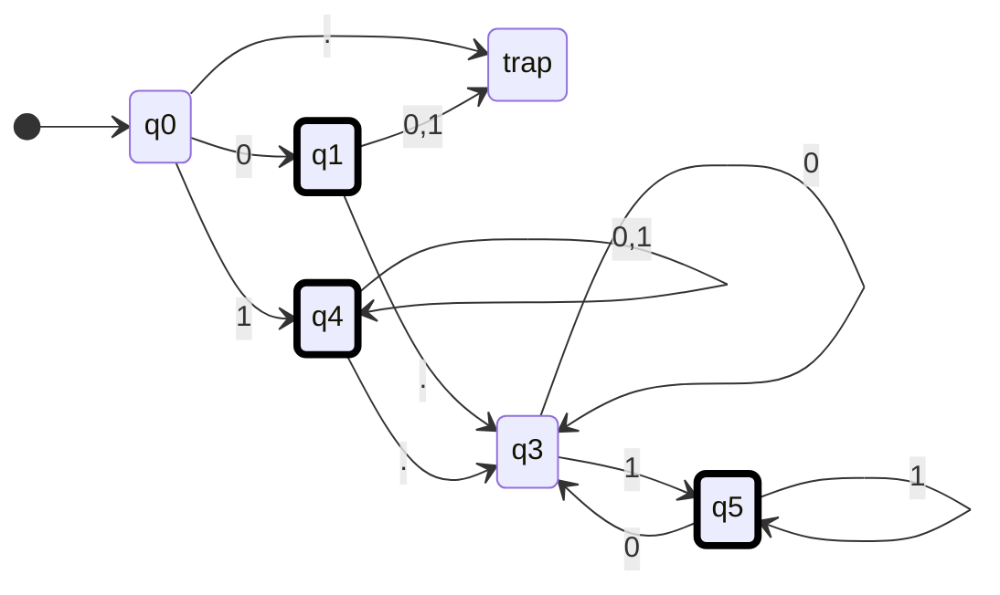
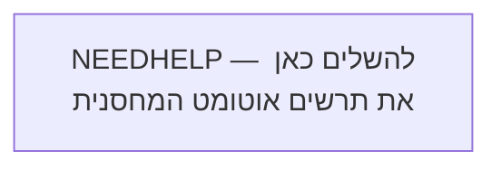
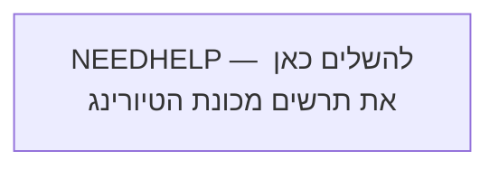

# מטלת הגשה מס' 5 — מסכמת

**קורס:** מודלים חישוביים  
**מורה:** צורי ויקטוריה  
**תאריך אחרון להגשה:** 7.07.2026

## הנחיות לביצוע המטלה

- ענו על כל השאלות שלפניכם.
- הגשת הפתרון היא אישית.

<strong>רפלקציה על ההשתלמות</strong>

מורים יקרים, יש לצרף לעבודה המסכמת רפלקציה קצרה על הקורס:

- האם אני מתכוון/ת ללמד את היחידה בשנת הלימודים הבאה?
- כיצד ההשתלמות תרמה לפיתוח המקצועי שלי?
- אילו מיומנויות חדשות למדתי בהשתלמות, וכיצד איישם אותן בהוראתי בעתיד?
- נקודות לשימור או לשיפור באופן העברת ההשתלמות.

### אזור כתיבה

**NEEDHELP — להשלים כאן את הרפלקציה האישית.**

---

<strong>שאלה 1 — אוטומט סופי דטרמיניסטי לא מלא</strong>

בנו **אוטומט סופי דטרמיניסטי לא מלא** המקבל את שפת כל המילים מעל האלפבית

$$
\Sigma = \{0,1,\texttt{.}\}
$$

המהוות מספרים בינאריים, עם נקודה עשרונית או בלעדיה, כאשר:

1. אם מופיעה נקודה, חייבת להיות לפחות ספרה אחת לפניה ולפחות ספרה אחת אחריה.
2. אם מופיעה נקודה, אסור שהמספר יסתיים ב־`0` — כלומר, לא תופיע בסופו ספרת `0` חסרת משמעות.
3. אסור שיופיעו אפסים מובילים.

### דוגמאות

| מילים השייכות לשפה | מילים שאינן שייכות לשפה |
|---|---|
| `0` | `0.0` |
| `10100` | `00101` |
| `0.101` | `1010.110` |
| `0.011` |  |
| `1001` |  |
{: .table-en}

### אזור עבודה — תרשים האוטומט

#### נסיון ראשון

#### האם האוטומט שלי נכון
כן, **מבחינת השפה שהאוטומט מקבל — הפתרון שלך תקף**.

המצבים אצלך מייצגים נכון את המצבים הלוגיים:

| מצב  | משמעות                                                                         |
| ---- | ------------------------------------------------------------------------------ |
| `q0` | תחילת הקלט — עדיין לא נקראה ספרה                                               |
| `q1` | נקרא בדיוק `0` בתחילת המספר                                                    |
| `q4` | החלק השלם התחיל ב־`1`, ולכן ניתן להמשיך עם `0` או `1`                          |
| `q3` | נקראה נקודה, ועדיין לא נקראה ספרה אחריה, או שהספרה האחרונה אחרי הנקודה היא `0` |
| `q5` | נמצאים אחרי הנקודה והספרה האחרונה היא `1`                                      |

### למה מצבי הקבלה נכונים?

* `q1` מקבל את המספר `0`.
* `q4` מקבל מספרים שלמים שמתחילים ב־`1`, כגון `1`, `10100`.
* `q5` מקבל מספרים עם נקודה שהספרה האחרונה שלהם היא `1`.

`q3` אינו מקבל, ובצדק, משום שהוא מייצג:

* מספר שמסתיים מיד אחרי הנקודה: `101.`
* או מספר שהחלק השברי שלו מסתיים ב־`0`: `101.110`

### בדיקה מול הדוגמאות

* `0` — מסתיים ב־`q1` ✅
* `10100` — מסתיים ב־`q4` ✅
* `0.101` — מסתיים ב־`q5` ✅
* `0.011` — מסתיים ב־`q5` ✅
* `00101` — מ־`q1` הקריאה של `0` נוסף מובילה לדחייה ✅
* `0.0` — מסתיים ב־`q3`, שאינו מקבל ✅
* `1010.110` — הספרה האחרונה היא `0`, ולכן מסתיים ב־`q3` ✅

## ההערה היחידה: מצב המלכודת

השאלה מבקשת **אס״ד לא מלא**, ולכן אין צורך לצייר את מצב `trap`.

במקום:

* מעבר מ־`q0` על `.`
* מעברים מ־`q1` על `0,1`

אפשר פשוט **לא להגדיר את המעברים האלה**. כאשר האוטומט ינסה לקרוא אותם, הוא ייתקע והמילה תידחה.

לכן הגרסה הנקייה יותר תהיה:

| מצב  | `0`      | `1`      | `.`      |
| ---- | -------- | -------- | -------- |
| `q0` | `q1`     | `q4`     | לא מוגדר |
| `q1` | לא מוגדר | לא מוגדר | `q3`     |
| `q4` | `q4`     | `q4`     | `q3`     |
| `q3` | `q3`     | `q5`     | לא מוגדר |
| `q5` | `q3`     | `q5`     | לא מוגדר |

מצבים מקבלים:

$$[
F={q1,q4,q5}
]$$

כלומר: **הרעיון והמעברים שלך נכונים; מומלץ פשוט למחוק את מצב המלכודת ואת המעברים אליו, כדי שהאוטומט יהיה בבירור אס״ד לא מלא.**

**לא השתכנעתי וגם אני חושב שהפתרון שלי יצא יותר יפה מהמרמייד** אבל אולי זה בגלל שאני רגיל שאנחנו בונים את המודלים משמאל לימין

---

<strong>שאלה 2 — שפה, רגולריות ואוטומט מחסנית</strong>

נתונה השפה:

$$
L = \left\{
 a^{i_1} b a^{i_2} b \dots c a^{i_n}
 \;\middle|\;
 n \ge 2;
 \ \forall k\ (1 \le k \le n),\ i_k \ge 1;
 \ i_1 = i_n
\right\}
$$

### הסבר לשפה

- אוסף כל המילים מעל האלפבית $\{a,b,c\}$ המכילות רצפים של `a`, כאשר `b` מפריד בין רצף לרצף.
- מספר אותיות ה־`a` ברצף הראשון שווה למספר אותיות ה־`a` ברצף האחרון.
- לפני הרצף האחרון מופיע `c` במקום `b`.

> **הערה חשובה:** רצף של `a` חייב להכיל לפחות `a` אחת.

### דוגמאות

| מילים השייכות לשפה | מילים שאינן שייכות לשפה |
|---|---|
| `abaaca` | `abca` |
| `aaabacaaa` | `ababa` |
|  | `abaacaa` |
{: .table-en}

> **NEEDHELP-CLARIFY — לבדוק אם רוצים לנסח את הביטוי הפורמלי במפורש גם עבור המקרה $n=2$, כדי למנוע עמימות במיקום ה־`b` וה־`c`.**

### סעיפים

א. מהי המילה הקצרה ביותר בשפה? נמקו את קביעתכם.

**NEEDHELP — להשלים מילה ונימוק.**

ב. האם השפה רגולרית? הוכיחו.

**NEEDHELP — להשלים טענה והוכחה.**

ג. בנו אוטומט מחסנית לשפה.

> **טיפ:** בדקו את האוטומט שבניתם על המילים שבדוגמה.

### אזור עבודה — אוטומט מחסנית

### טבלת מעברים לאוטומט המחסנית

| מצב נוכחי | תו קלט | ראש המחסנית | מצב הבא | פעולה במחסנית |
|---|---|---|---|---|
| `NEEDHELP` |  |  |  |  |
|  |  |  |  |  |
|  |  |  |  |  |
|  |  |  |  |  |
{: .table-en}

---

<strong>שאלה 3 — מכונת טיורינג באונרית</strong>

נתונה מכונת טיורינג המקבלת כקלט מספר שלם הכתוב באונרית, ונותנת כפלט מספר שלם הכתוב באונרית.

לפניכם קבוצת המעברים של המכונה:

| מצב נוכחי | הסימן הנקרא | מצב הבא | הסימן הנכתב | תנועה |
|---|---|---|---|---|
| `q0` | `1` | `q1` | `x` | ימין |
| `q1` | `1` | `q2` | `x` | ימין |
| `q1` | `Δ` | `q7` | `$` | ימין |
| `q2` | `1` | `q3` | `x` | ימין |
| `q2` | `Δ` | `q6` | `$` | ימין |
| `q3` | `1` | `q1` | `x` | ימין |
| `q3` | `Δ` | `q4` | `$` | ימין |
| `q4` | `Δ` | `q5` | `$` | ימין |
| `q6` | `Δ` | `q7` | `1` | ימין |
| `q7` | `Δ` | `q4` | `1` | ימין |
{: .table-en}

המצב `q5` הוא מצב מקבל.

### סעיפים

א. ציירו אוטומט מכונת טיורינג לפי קבוצת המעברים.

ב. בנו מעקב על המספר `5`.

| צעד | מצב | תוכן הסרט | מיקום הראש | המעבר שבוצע |
|---:|---|---|---|---|
| 0 | `q0` | `11111` |  |  |
| 1 |  |  |  |  |
| 2 |  |  |  |  |
| 3 |  |  |  |  |
| `NEEDHELP` |  |  |  |  |
{: .table-en}

**NEEDHELP — להוסיף שורות לפי מספר צעדי החישוב.**

ג. הגדירו את הפונקציה שמכונת הטיורינג מבצעת.

**NEEDHELP — להשלים את הגדרת הפונקציה בלבד.**

ד. היכן מתבטאת העובדה שהמכונה אינה מטפלת במספר `0`? הוסיפו את הדרוש.

**NEEDHELP — להסביר ולהוסיף מעבר או מעברים נדרשים.**

---

<strong>שאלה 4 — מכונת טיורינג המחלקת זוגי ב־2 ומפחיתה 1 מאי־זוגי</strong>

כתבו מכונת טיורינג המקבלת בתחילת הסרט מספר אונרי הגדול מ־1, ומחזירה מספר חדש כמפורט להלן:

- אם המספר שהתקבל **זוגי** — המכונה מחזירה את המספר המקורי חלקי `2`.
- אם המספר שהתקבל **אי־זוגי** — המכונה מחזירה את המספר המקורי פחות `1`.

### הנחיות

- אין צורך לשמור על הקלט; אפשר לשנות את הקלט לסימנים שונים.
- המספר המוחזר יופיע במקום כלשהו בסרט בין שני סימני `$`.
- אין צורך לבדוק את תקינות הקלט.

## דוגמה למספר זוגי

### הסרט לפני ההרצה

| תא | 0 | 1 | 2 | 3 | 4 | 5 | 6 | 7 | 8 | 9 | 10 | 11 |
|---|---|---|---|---|---|---|---|---|---|---|---|---|
| תוכן | `⊢` | `1` | `1` | `1` | `1` | `1` | `1` | `Δ` | `Δ` | `Δ` | `Δ` | `Δ` |
{: .table-en}

### הסרט לאחר ההרצה

| תא | … | 0 | 1 | 2 | 3 | 4 |
|---|---|---|---|---|---|---|
| תוכן | `…` | `$` | `1` | `1` | `1` | `$` |
{: .table-en}

## דוגמה למספר אי־זוגי

### הסרט לפני ההרצה

| תא | 0 | 1 | 2 | 3 | 4 | 5 | 6 | 7 | 8 | 9 | 10 |
|---|---|---|---|---|---|---|---|---|---|---|---|
| תוכן | `⊢` | `1` | `1` | `1` | `1` | `1` | `Δ` | `Δ` | `Δ` | `Δ` | `Δ` |
{: .table-en}

### הסרט לאחר ההרצה

| תא | … | 0 | 1 | 2 | 3 | 4 | 5 |
|---|---|---|---|---|---|---|---|
| תוכן | `…` | `$` | `1` | `1` | `1` | `1` | `$` |
{: .table-en}

### אזור עבודה — תרשים המכונה

### טבלת מעברים

| מצב נוכחי | הסימן הנקרא | מצב הבא | הסימן הנכתב | תנועה | הערה |
|---|---|---|---|---|---|
| `NEEDHELP` |  |  |  |  |  |
|  |  |  |  |  |  |
|  |  |  |  |  |  |
|  |  |  |  |  |  |
|  |  |  |  |  |  |
{: .table-en}

**NEEDHELP — להשלים את האלפבית הנוסף, המצבים, המעברים והמצב המקבל.**

