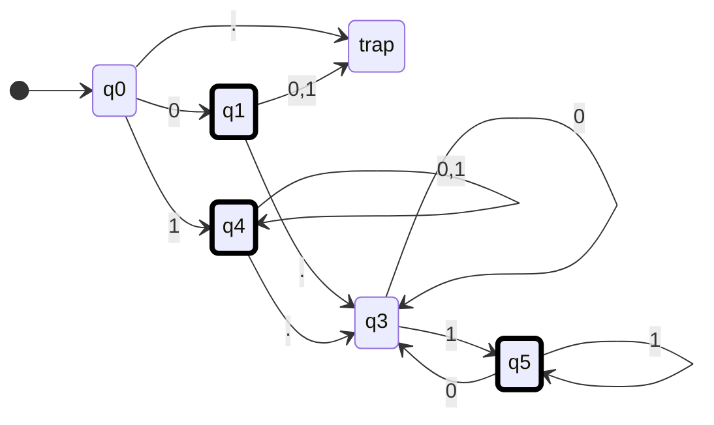
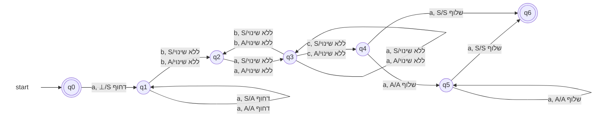
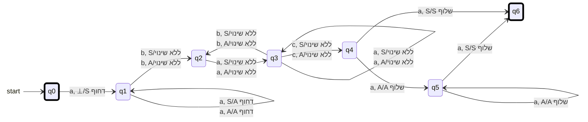
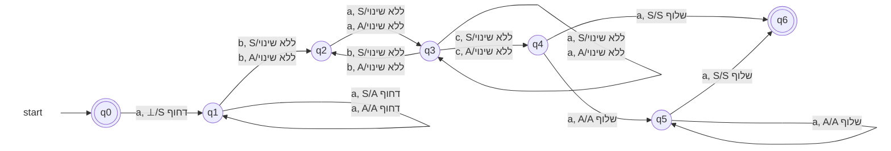
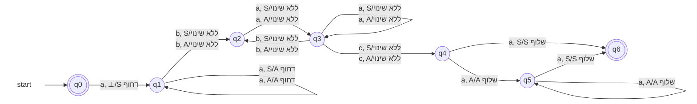
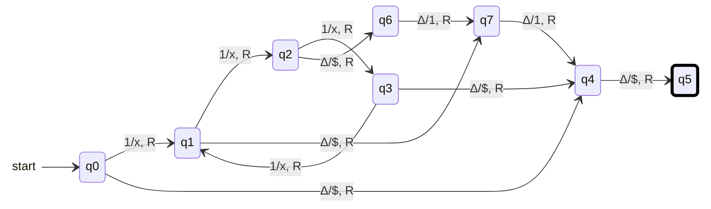
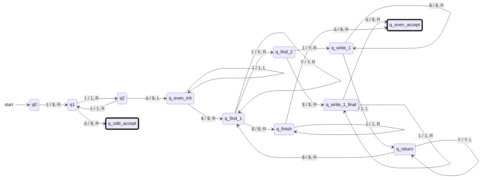
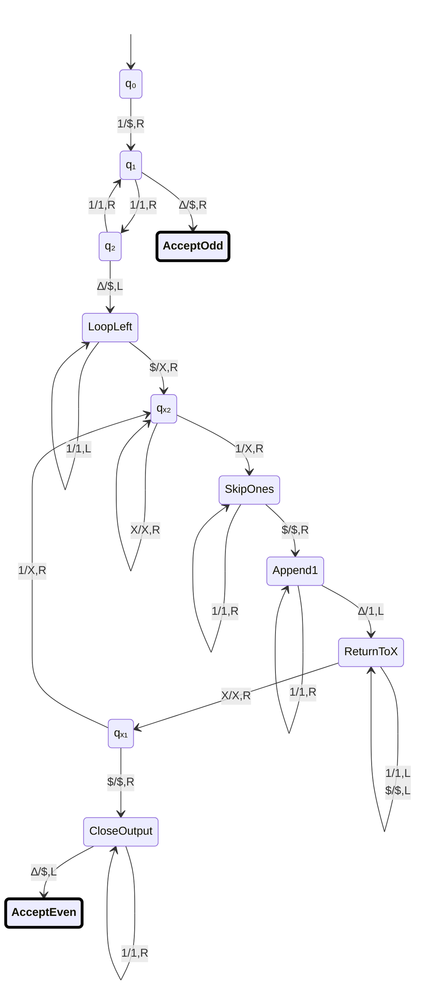

# מטלת הגשה מס' 5 — מסכמת


**קורס:** מודלים חישוביים  
**מורה:** צורי ויקטוריה  
**תאריך אחרון להגשה:** 7.07.2026

## הנחיות לביצוע המטלה

<details open markdown="1">
<summary><strong>רפלקציה על ההשתלמות</strong></summary>

ויקטוריה מלמדת בצורה ברורה ומסודרת ומלווה את הקורס בחומרים מעולים ובסרטונים. אלו ללא ספק יאפשרו לי לחזור לחומרים ולדייק את ההבנה.

### האם אני מתכוון/ת ללמד את היחידה בשנת הלימודים הבאה?

  לא אלמד בשנה הבאה. אני מעדיף להיות בשל יותר, ולא לנטוש את הוראת תמ"ע בשנה הקרובה.

### כיצד ההשתלמות תרמה לפיתוח המקצועי שלי?

  ההשתלמות תאפשר לי ללמד בעתיד, והכירה לי תחום שחדש לי.

### אילו מיומנויות חדשות למדתי בהשתלמות, וכיצד איישם אותן בהוראתי בעתיד?

  למדתי תחום חדש בו ניתן ללמד לוגיקה. למדתי היכן נמצאים מודלי שפה כיום ביכולת לעזור בפתרון בעיות / בקרה / וכתיבת תכנים במודלים. עוד במטלה הראשונה או השניה ראיתי שניתן לרנדר יחסית בקלות במרמייד, וגם להמיר פתרון בכתב יד למרמייד שעובד. בהמשך ראיתי שיש תמיכה מפורשת ב-`stateDiagram-v2` אפילו שרוב הדיאגרמות כאן הן עדיין מסוג אחר. ראיתי **שבשימוש נכון** המודלים יכולים לסייע ולפרט לתלמיד היכן הטעות שלו, ושבסך הכל הפתרונות שלי בשאלות אותן הגשתי הם טובים אבל עדיין לא מושלמים. 
  ==בנוסף למדתי בהגשת המטלה המסכמת שהמודלים משתמשים במהלכי אפסילון שאינם מותרים לשימוש בבגרות,== ואם התלמיד לא ער לכך ואינו מנחה את המודל, הוא יקבל פתרונות שאינם קבילים. נובע מכך שרצוי להכין `GEM` לצורך סיוע תקין בפתרונות (או שמורה יכול להיעזר בעובדה שתלמידים יפספסו את הדקויות הללו, כדי לזהות העתקות)

  על כל פנים הגישה שלי שצריך לבחון יותר עומדת בהינה.

### נקודות לשימור או לשיפור באופן העברת ההשתלמות

  בסוף ההשתלמות נפתח קלאסרום, ואני מצטער שלא היה קלאסרום לאורך כל ההשתלמות.
  נקודה לשיפור לעצמי - להפחית עומסים כדי לא להפסיד מפגשים. לא רואה שזה קורה כרגע. ולכן דווקא הפתרון של לעבור את ההשתלמות שוב בעתיד הוא רעיון טוב. זה לגמרי נושא שעדיף לתת לו לשקוע, ולהתמקצע בו טוב לפני שמלמדים. חשוב להבהיר שההשתלמות דורשת יותר זמן עבודה מאשר מה שנדמה ומוקצב. בהנחה שמורה רוצה לוודא שהפתרונות שלו נכונים ולא סתם מגיש.

</details>

---

<details open markdown="1">
<summary><strong>שאלה 1 — אוטומט סופי דטרמיניסטי לא מלא</strong></summary>

בנו **אוטומט סופי דטרמיניסטי לא מלא** המקבל את שפת כל המילים מעל האלפבית

$$
\Sigma = \{0,1,\texttt{.}\}
$$

המהוות מספרים בינאריים, עם נקודה עשרונית או בלעדיה, כאשר:

1. אם מופיעה נקודה, חייבת להיות לפחות ספרה אחת לפניה ולפחות ספרה אחת אחריה.
2. אם מופיעה נקודה, אסור שהמספר יסתיים ב־`0` — כלומר, לא תופיע בסופו ספרת `0` חסרת משמעות.
3. אסור שיופיעו אפסים מובילים.

### דוגמאות

| מילים השייכות לשפה | מילים שאינן שייכות לשפה |
|---|---|
| `0` | `0.0` |
| `10100` | `00101` |
| `0.101` | `1010.110` |
| `0.011` |  |
| `1001` |  |
{: .table-en}

### אזור עבודה — תרשים האוטומט

#### נסיון ראשון


#### האם האוטומט שלי נכון
כן, **מבחינת השפה שהאוטומט מקבל — הפתרון שלך תקף**.

המצבים אצלך מייצגים נכון את המצבים הלוגיים:

| מצב  | משמעות                                                                         |
| ---- | ------------------------------------------------------------------------------ |
| `q0` | תחילת הקלט — עדיין לא נקראה ספרה                                               |
| `q1` | נקרא בדיוק `0` בתחילת המספר                                                    |
| `q4` | החלק השלם התחיל ב־`1`, ולכן ניתן להמשיך עם `0` או `1`                          |
| `q3` | נקראה נקודה, ועדיין לא נקראה ספרה אחריה, או שהספרה האחרונה אחרי הנקודה היא `0` |
| `q5` | נמצאים אחרי הנקודה והספרה האחרונה היא `1`                                      |

### למה מצבי הקבלה נכונים?

* `q1` מקבל את המספר `0`.
* `q4` מקבל מספרים שלמים שמתחילים ב־`1`, כגון `1`, `10100`.
* `q5` מקבל מספרים עם נקודה שהספרה האחרונה שלהם היא `1`.

`q3` אינו מקבל, ובצדק, משום שהוא מייצג:

* מספר שמסתיים מיד אחרי הנקודה: `101.`
* או מספר שהחלק השברי שלו מסתיים ב־`0`: `101.110`

### בדיקה מול הדוגמאות

* `0` — מסתיים ב־`q1` ✅
* `10100` — מסתיים ב־`q4` ✅
* `0.101` — מסתיים ב־`q5` ✅
* `0.011` — מסתיים ב־`q5` ✅
* `00101` — מ־`q1` הקריאה של `0` נוסף מובילה לדחייה ✅
* `0.0` — מסתיים ב־`q3`, שאינו מקבל ✅
* `1010.110` — הספרה האחרונה היא `0`, ולכן מסתיים ב־`q3` ✅

## ההערה היחידה: מצב המלכודת

השאלה מבקשת **אס״ד לא מלא**, ולכן אין צורך לצייר את מצב `trap`.

במקום:

* מעבר מ־`q0` על `.`
* מעברים מ־`q1` על `0,1`

אפשר פשוט **לא להגדיר את המעברים האלה**. כאשר האוטומט ינסה לקרוא אותם, הוא ייתקע והמילה תידחה.

לכן הגרסה הנקייה יותר תהיה:

| מצב  | `0`      | `1`      | `.`      |
| ---- | -------- | -------- | -------- |
| `q0` | `q1`     | `q4`     | לא מוגדר |
| `q1` | לא מוגדר | לא מוגדר | `q3`     |
| `q4` | `q4`     | `q4`     | `q3`     |
| `q3` | `q3`     | `q5`     | לא מוגדר |
| `q5` | `q3`     | `q5`     | לא מוגדר |

מצבים מקבלים:

$$[
F={q1,q4,q5}
]$$

כלומר: **הרעיון והמעברים שלך נכונים; מומלץ פשוט למחוק את מצב המלכודת ואת המעברים אליו, כדי שהאוטומט יהיה בבירור אס״ד לא מלא.**

**לא השתכנעתי וגם אני חושב שהפתרון שלי יצא יותר יפה מהמרמייד** אבל אולי זה בגלל שאני רגיל שאנחנו בונים את המודלים משמאל לימין




</details>

---

<details open markdown="1">
<summary><strong>שאלה 2 — שפה, רגולריות ואוטומט מחסנית</strong></summary>

נתונה השפה:

$$
L = \left\{
 a^{i_1} b a^{i_2} b \dots c a^{i_n}
 \;\middle|\;
 n \ge 2;
 \ \forall k\ (1 \le k \le n),\ i_k \ge 1;
 \ i_1 = i_n
\right\}
$$

### הסבר לשפה

- אוסף כל המילים מעל האלפבית $\{a,b,c\}$ המכילות רצפים של `a`, כאשר `b` מפריד בין רצף לרצף.
- מספר אותיות ה־`a` ברצף הראשון שווה למספר אותיות ה־`a` ברצף האחרון.
- לפני הרצף האחרון מופיע `c` במקום `b`.

> **הערה חשובה:** רצף של `a` חייב להכיל לפחות `a` אחת.

### דוגמאות

| מילים השייכות לשפה | מילים שאינן שייכות לשפה |
|---|---|
| `abaaca` | `abca` |
| `aaabacaaa` | `ababa` |
|  | `abaacaa` |
{: .table-en}


### סעיפים

{: .alefbet}

1. **מהי המילה הקצרה ביותר בשפה?** נמקו את קביעתכם.
 המילה הכי קצרה היא abaca מפני שמוגדר שבכל אחת מקבוצות ה-a חייב להיות לפחות אחד. כלומר לא יתכן aca
1. **האם השפה רגולרית? הוכיחו.**
    נוכיח בשלילה שהשפה אינה רגולרית.
    נניח שקיים DFA בשם $M$ שמקבל את השפה. נניח של־$M$ יש $m$ מצבים.

    נסתכל על $m+1$ התחיליות:

    $$a^1,\ a^2,\ a^3,\ \dots,\ a^{m+1}$$

    אחרי קריאת כל אחת מהתחיליות האלה, האוטומט נמצא באחד מ־$m$ מצבים בלבד. לכן, לפי עקרון שובך היונים, קיימים שני מספרים שונים $i<j$ כך שאחרי קריאת $a^i$ ואחרי קריאת $a^j$ האוטומט נמצא באותו מצב.

    ```mermaid
    stateDiagram-v2
        direction LR
        [*] --> q0
        q0 --> qr : aⁱ
        q0 --> qr : aʲ

        qr --> qaccept : bacaⁱ
        qr --> qreject : bacaⁱ

        note right of qaccept : aⁱ b a c aⁱ belongs to L
        note right of qreject : aʲ b a c aⁱ </br>does'nt belong to L

        class qaccept accepting
        class qreject rejecting
        classDef accepting stroke:#000,stroke-width:4px
        classDef rejecting stroke:#b00020,stroke-width:4px
    ```

    כעת נוסיף לשתי התחיליות את אותה סיומת: $bac a^i$.

    מצד אחד:

    $$a^i b a c a^i \in L$$

    כי מספר אותיות ה־`a` ברצף הראשון שווה למספר אותיות ה־`a` ברצף האחרון.

    מצד שני:

    $$a^j b a c a^i \notin L$$

    כי $j \ne i$, ולכן מספר אותיות ה־`a` ברצף הראשון שונה ממספר אותיות ה־`a` ברצף האחרון.

    אבל ה־DFA נמצא באותו מצב אחרי $a^i$ ואחרי $a^j$, והוא מקבל עכשיו את אותה סיומת בדיוק, $bac a^i$. לכן הוא חייב להגיע לאותה תשובה בשני המקרים. **קיבלנו סתירה:** אותה ריצה מאותו מצב עם אותה סיומת צריכה גם לקבל וגם לדחות.

    לכן לא קיים DFA שמקבל את השפה, ומכאן שהשפה אינה רגולרית.
    
1. בנו אוטומט מחסנית לשפה.

### אזור עבודה — אוטומט מחסנית


הפתרון שלך כמעט מושלם ומיישם בצורה מצוינת את כללי הטקס של משרד החינוך! הקפדת להימנע ממעברי אפסילון בסוף המילה, והשתמשת נכון בסימן `S` כדי לסמן את ה-`a` הראשון במחסנית ולקזז אותו עם ה-`a` האחרון.

עם זאת, יש למודל שלך נקודת תורפה אחת (באג קטן) שמונעת ממנו לקבל את כל המילים בשפה.

### הבעיה: מה קורה כשיש רק `a` אחד ברצף? ($i_1 = 1$)

כפי שציינת בעצמך בפתרון לסעיף א', המילה הקצרה ביותר בשפה היא `abaca`.
בוא נריץ את המילה הזו על האוטומט שציירת:

1. **קריאת `a` ראשון:** מתחילים ב-`q0`, קוראים `a`, דוחפים `S` ועוברים ל-`q1`. (המחסנית מכילה כעת `S` מעל `⊥`).
2. **קריאת `b`:** קוראים `b`, קוראים את ראש המחסנית בלי לשנות אותו, ועוברים ל-`q2`.
3. **קריאת `a` אמצעי:** קוראים `a`, קוראים את ראש המחסנית בלי לשנות אותו, ועוברים ל-`q3`.
4. **קריאת `c`:** קוראים `c`, קוראים את ראש המחסנית בלי לשנות אותו, ועוברים ל-`q4`.
5. **קריאת `a` אחרון (מצב `q4`):** אנחנו ב-`q4` עם `a` בקלט, ובראש המחסנית מחכה לנו `S` (כי היה רק `a` אחד ברצף הראשון).
**כאן אנחנו נתקעים.** המעבר היחיד שיוצא מ-`q4` דורש שיהיה `A` בראש המחסנית (`a, A/A שלוף`). אין מ-`q4` מעבר שמאפשר לשלוף `S`, ולכן המילה התקינה `abaca` תידחה.

**התיקון:**
כדי לטפל במצב שבו $i_1 = 1$ (ולכן $i_n = 1$), צריך להוסיף מעבר ישיר מ-`q4` ל-`q6` על הקלט `a` עם שליפה של `S`.

---

### הערה לגבי הרישום "דלג"

השימוש במילה "דלג" (Skip) למעברים ב-`q1, q2, q3` הוא מאוד ברור אינטואיטיבית, אבל הוא לא מספיק מדויק כאן: במודל פורמלי של אוטומט מחסנית, המכונה *חייבת* לקרוא את ראש המחסנית בכל צעד.
לכן, כדי להגיד "אל תיגע במחסנית", צריך לכתוב מעברים מקבילים לפי הסימן האפשרי בראש המחסנית. בסימון המקוצר כאן מספיק לציין את ראש המחסנית הנקרא, בלי לחזור עליו אחרי `/`. למשל, במקום `דלג b` מ-`q1` ל-`q2`, נכתוב:

* `ללא שינוי b, A` (קראנו `b`, בראש המחסנית `A`, והמחסנית לא משתנה).
* `ללא שינוי b, S` (קראנו `b`, בראש המחסנית `S`, והמחסנית לא משתנה).

אותו עיקרון חוזר בכל מעברי הביניים: צריך לכסות גם `S` וגם `A`, כי שניהם יכולים להופיע בראש המחסנית בזמן קריאת הבלוקים האמצעיים.

---

### תמלול ל-Mermaid (כולל התיקון)

הכנתי לך את התמלול ל-Mermaid של השרטוט שלך. **הוספתי פנימה את המעבר החסר מ-`q4` ל-`q6`** כדי שהאוטומט יהיה מושלם.



---



{: .box-note}
המעבר העצמי של `q1` על `S` נשאר בכוונה: אחרי קריאת ה-`a` הראשון עוברים מ-`q0` ל-`q1` כאשר `S` בראש המחסנית, ולכן אם הרצף הראשון מכיל `a` נוסף, צריך לדחוף `A` מעל `S`. המעבר על `A` מטפל ב-`a` השלישי והלאה.

{: .box-note}
 פרומפט: תקן את המרמייד כדי שיהיה בכתיבה מפורטת. כמו כן בגלל עימוד עברית אנגלית, המילה דחוף או שלוף או ללא שינוי חייבת להופיע בסוף במקום בהתחלה או בהתחלה במקום בסוף (הפוך מהמקום בו שמת אותה)


מעולה, הבנתי בדיוק את הבעיה! בעיות של כיווניות טקסט (RTL/LTR) במרמייד בשילוב עברית ואנגלית יכולות להיות מתסכלות.

כדי לפתור את זה:

1. **החזרתי את הסימון לסדר הטבעי שלו:** לאחר ש-Mermaid מוגדר כ-LTR, אפשר לכתוב `a, A/A שלוף`, `a, S/A דחוף` ו-`b, S/ללא שינוי` בלי להפוך את סדר המילים כדי לעקוף בעיית RTL.
2. **פירטתי את כל מעברי ה"ללא שינוי":** החלפתי את המילה "דלג" ברישום המפורט לפי התמונה שצירפת. מכיוון שבשלבי הביניים (בזמן קריאת ה-`b`, `a` וה-`c`) במחסנית יכול להיות בראשה או `S` (אם היה רק `a` אחד בהתחלה) או `A` (אם היו כמה), הוספתי מעברים מקבילים לשני המקרים בכל מצב.

הנה הקוד המעודכן עבורך:



**שינויים שבוצעו:**

* כל רישומי ה"דלג" הוחלפו למבנה מפורט (למשל `b, S/ללא שינוי` ו-`b, A/ללא שינוי`).
* מילות הפעולה בעברית נשארות בסדר הטבעי של הסימון, משום שהדיאגרמות מרונדרות כ-LTR.
* כזכור מההודעה הקודמת, כללתי כאן גם את המעברים ל-`q6` על `S` מתוך `q4` ו-`q5` כדי לכסות את כל מקרי הקצה של כמות ה-`a`.


מרמייד אכן יכול להיות קצת עקשן בכל מה שקשור לסידור אלמנטים על המסך. במיוחד כשיש לולאה (Self-loop) יחד עם חצים שיוצאים ונכנסים מאותו מצב, והטקסטים ארוכים בגלל הפירוט, נוצרת התנגשות חזותית. בתור מודל AI שכותב קוד לתרשימים, אני נתקל במגבלות הרינדור האלו של Mermaid לא מעט.

{: .box-note}
פרומפט: הלולאה ב-q3 והמעבר מ-q3 ל-q4 מתנגשים - הטקסט מופיע אחד על השני. יש משהו שניתן לעשות עם זה?

### הפתרון

הדרך הפשוטה והיעילה ביותר לטפל בזה ב-Mermaid היא **להאריך את החץ** שיוצא מ-`q3` ל-`q4`.
במקום להשתמש בחץ סטנדרטי (`-->`), נשתמש בחץ ארוך יותר עם שלושה או ארבעה מקפים (למשל `---->`). הפעולה הזו לא משנה את הלוגיקה של האוטומט, אבל היא מכריחה את מנוע הרינדור של מרמייד להרחיק את `q4` מ-`q3`, מה שמשאיר מספיק "אוויר" לטקסט של הלולאה לצוף מבלי לדרוס שום דבר.

הנה הקוד המעודכן עם הריווח המוגדל (שים לב לשורה של `q3` ל-`q4`):



</details>

---

<details open markdown="1">
<summary><strong>שאלה 3 — מכונת טיורינג באונרית</strong></summary>

נתונה מכונת טיורינג המקבלת כקלט מספר שלם הכתוב באונרית, ונותנת כפלט מספר שלם הכתוב באונרית.

לפניכם קבוצת המעברים של המכונה:

| מצב נוכחי | הסימן הנקרא | מצב הבא | הסימן הנכתב | תנועה |
|---|---|---|---|---|
| `q0` | `1` | `q1` | `x` | ימין |
| `q1` | `1` | `q2` | `x` | ימין |
| `q1` | `Δ` | `q7` | `$` | ימין |
| `q2` | `1` | `q3` | `x` | ימין |
| `q2` | `Δ` | `q6` | `$` | ימין |
| `q3` | `1` | `q1` | `x` | ימין |
| `q3` | `Δ` | `q4` | `$` | ימין |
| `q4` | `Δ` | `q5` | `$` | ימין |
| `q6` | `Δ` | `q7` | `1` | ימין |
| `q7` | `Δ` | `q4` | `1` | ימין |
{: .table-en}

המצב `q5` הוא מצב מקבל.

### סעיפים

{: .alefbet}
א. ציירו אוטומט מכונת טיורינג לפי קבוצת המעברים.


את המעבר מ-q₀⟶q₄ הוספתי אחר כך.

ב. בנו מעקב על המספר `5`.

הערה: את המודל נתתי לבינה לכתוב. את המעקב ביצעתי בעצמי.

| צעד | מצב | תוכן הסרט | מיקום הראש | המעבר שבוצע |
|---:|---|---|---|---|
| 0 | `q0` | `x1111∆∆∆` | R | `q1` |
| 1 | `q1` | `xx111∆∆∆` | R | `q2` |
| 2 | `q2` | `xxx11∆∆∆` | R | `q3` |
| 3 | `q3` | `xxxx1∆∆∆` | R | `q1` |
| 4 | `q1` | `xxxxx∆∆∆` | R | `q2` |
| 5 | `q2` | `xxxxx$∆∆` | R | `q6` |
| 6 | `q6` | `xxxxx$1∆` | R | `q7` |
| 7 | `q7` | `xxxxx$11∆∆` | R | `q4` |
| 8 | `q4` | `xxxxx$11$∆` | R | `q5` |

{: .table-en}

ג. הגדירו את הפונקציה שמכונת הטיורינג מבצעת.

הניחוש המושכל שלי: מחשבת מודולו 3. היא תמיד מגיעה למצב מקבל כי החיצים בסוף לא חוזרים לאחור. אז השאלה היא רק כמה $1$ היא תרשום. כיוון שנרשם פעמיים 1 ניתן לנחש שזה המצב בסבירות גבוה. כדי לדעת בוודאות צריך לנתח גם מעקב על 4. או לקרוא בתשובות, או לנתח ולשים לב שיש מספר כניסות לאיזור הסיום. אחת שתוביל לכתיבת פעמיים 1, אחת שתוביל לכתיבה של פעם אחת 1, ואחת שתעקוף הכל ולא תכתוב 1 בכלל. זה בדיוק מה שצריך כי השאריות $\in{0,1,2}$

לפי הבינה: המכונה מתפקדת כפונקציה מחשבת (Transducer). עבור קלט של $n$ פעמים הספרה 1, המכונה "מוחקת" את הקלט המקורי (הופכת אותו ל-x), ומשרשרת בסופו את התוצאה של $n \bmod 3$ בייצוג אונרי, כשהתוצאה עטופה בסימני דולר ($).

ד. היכן מתבטאת העובדה שהמכונה אינה מטפלת במספר `0`? הוסיפו את הדרוש.
למיטב הבנתי זה שאין מעבר מ-q₀ במקרה שיש ∆ אומר שאין טיפול ב-0.

</details>

---

<details open markdown="1">
<summary><strong>שאלה 4 — מכונת טיורינג המחלקת זוגי ב־2 ומפחיתה 1 מאי־זוגי</strong></summary>

כתבו מכונת טיורינג המקבלת בתחילת הסרט מספר אונרי הגדול מ־1, ומחזירה מספר חדש כמפורט להלן:

- אם המספר שהתקבל **זוגי** — המכונה מחזירה את המספר המקורי חלקי `2`.
- אם המספר שהתקבל **אי־זוגי** — המכונה מחזירה את המספר המקורי פחות `1`.

### הנחיות

- אין צורך לשמור על הקלט; אפשר לשנות את הקלט לסימנים שונים.
- המספר המוחזר יופיע במקום כלשהו בסרט בין שני סימני `$`.
- אין צורך לבדוק את תקינות הקלט.

## דוגמה למספר זוגי

### הסרט לפני ההרצה

| תא | 0 | 1 | 2 | 3 | 4 | 5 | 6 | 7 | 8 | 9 | 10 | 11 |
|---|---|---|---|---|---|---|---|---|---|---|---|---|
| תוכן | `⊢` | `1` | `1` | `1` | `1` | `1` | `1` | `Δ` | `Δ` | `Δ` | `Δ` | `Δ` |
{: .table-en}

### הסרט לאחר ההרצה

| תא | … | 0 | 1 | 2 | 3 | 4 |
|---|---|---|---|---|---|---|
| תוכן | `…` | `$` | `1` | `1` | `1` | `$` |
{: .table-en}

## דוגמה למספר אי־זוגי

### הסרט לפני ההרצה

| תא | 0 | 1 | 2 | 3 | 4 | 5 | 6 | 7 | 8 | 9 | 10 |
|---|---|---|---|---|---|---|---|---|---|---|---|
| תוכן | `⊢` | `1` | `1` | `1` | `1` | `1` | `Δ` | `Δ` | `Δ` | `Δ` | `Δ` |
{: .table-en}

### הסרט לאחר ההרצה

| תא | … | 0 | 1 | 2 | 3 | 4 | 5 |
|---|---|---|---|---|---|---|---|
| תוכן | `…` | `$` | `1` | `1` | `1` | `1` | `$` |
{: .table-en}

### אזור עבודה — תרשים המכונה

**כיוון לעבודה:** נבנה מכונה שלקראת סופה יודעת אם המספר זוגי או אי זוגי (על בסיס הטכניקות בתרגיל קודם שמבצעות מודולו 3). בהמשך נחזור לאחור דרך שני אפיקים שונים, האחד שיודע לחתוך ספרה שאולי לא נחוץ (אם הגענו לסוף הקלט והמספר דורש החסרת אחד- כבר ביצענו זאת ורק צריך להחליף את המשולש). האחר שיודע ממש לחתוך את אורך המספר. עדיין לא יודע איך.


אז יוצא שהרעיון לזיהוי זוגיות, והפתרון לאי זוגי הוא בסדר אבל עדיין חסר החלק הקשה.


## הרמת הידיים
אז כיוון מה שהגעתי אליו כבר מאוחר בלילה, צריך לדעת לעצור ולהתקדם. זה מה שהיה לג'מיני להציע:

רעיון מעולה, והאינטואיציה שלך לגבי המקרה האי-זוגי פשוט **בול בול בול**!

בגלל שהקלט גדול מ-1, אם המספר אי-זוגי ($n$), המכונה שלך פשוט הופכת את ה-`1` הראשון ל-`$` (נשארו $n-1$ אחדות), מגיעה לסוף, שמה שם `$` ומתקבל בדיוק $n-1$ בין שני דולרים. פתרון אלגנטי ברמות.

לגבי המקרה הזוגי – נתקעת בצדק, כי "לכווץ" את ה-`1`ים שנשארו אחרי שסימנת כל איבר שני ב-`X` זה אכן כאב ראש שמצריך המון מעברים ימינה ושמאלה כדי להזיז אותם אחד אחד.

הנה הטיפ שיציל אותך: **מותר לך לכתוב את הפלט במקום חדש על הסרט!** ההנחיה אומרת שתוצאה צריכה להופיע *במקום כלשהו* בין שני סימני `$`. היא לא חייבת להתחיל באותו תא שבו התחיל הקלט.

### האסטרטגיה למספר זוגי:

כאשר המכונה מגיעה ל-$q_2$ וקוראת $\Delta$, היא יודעת שהמספר **זוגי**. בשלב זה על הסרט יש לנו `$` אחד בהתחלה, ואז $n-1$ אחדות.
אנחנו פשוט נהפוך את ה-$\Delta$ הנוכחי ל-`$` (זה יהיה הדולר השמאלי של התוצאה החדשה שלנו), נחזור להתחלה, ונתחיל לעשות "זוג או פרד" על ה-`1`ים שנשארו: על כל זוג של `1`ים שנמחק משמאל (נסמן ב-`X` וב-`Y`), נדפיס `1` אחד חדש מימין לדולר האמצעי!

מכיוון ש-$n$ זוגי, מספר ה-`1`ים שנשארו על הסרט ($n-1$) הוא תמיד אי-זוגי. חלוקה שלו ב-2 עם עיגול למעלה ($\lceil (n-1)/2 \rceil$) תיתן לנו בדיוק $n/2$ – שזה בדיוק חצי מהמספר המקורי!

---

### קוד המרמייד המלא (כולל התיקון ל-MathJax):

אז התקבל כאן פתרון די מזעזע ברמת הסרבול שלו, על ידי ג'מיני, 
והפתרון שהציע gpt נראה יותר גרוע.

לכן מה שעשיתי בהמשך הוא לבקש אלגוריתם ידוע אופטימאלי לחלוקה ב-2 (מפני שאת הזוגיות אני יודע למצוא ולהבין בקלות)

באופן די מפתיע, הבעיה הזו השאירה את `Sonnet 5 high` במחשבות ארוכות, מהסוג שהוא חושב כשהוא נתקע.



---

### איך החלק הזוגי עובד בפועל? (דוגמה עבור הקלט `1111`)

1. **השלב שלך:** המכונה מגיעה ל-$\Delta$ במצב $q_2$. הסרט נראה כך: `#36; 1 1 1 Δ`.
2. **הכנה לזוגי ($q\_even\_init$):** היא כותבת `$` במקום ה-$\Delta$ וחוזרת שמאלה עד ל-`$` הראשון. הסרט כעת: `#36; 1 1 1 #36; Δ`.
3. **סריקת זוגות:**
* במצב $q\_find\_1$ היא מוצאת `1` ראשון, הופכת אותו ל-`X` ועוברת ל-$q\_find\_2$.
* במצב $q\_find\_2$ היא מוצאת את ה-`1` השני, הופכת אותו ל-`Y` ועוברת ל-$q\_write\_1$.
* המכונה רצה ימינה מעבר ל-`$` האמצעי, מוצאת את ה-$\Delta$ הראשונה, כותבת שם `1` וחוזרת להתחלה.
* הסרט כעת: `#36; X Y 1 #36; 1 Δ`.


4. **סיבוב שני:**
* היא מדלגת על `X` ו-`Y`. במצב $q\_find\_1$ היא מוצאת את ה-`1` האחרון, הופכת אותו ל-`X` ועוברת ל-$q\_find\_2$.
* במצב $q\_find\_2$ היא ממשיכה ימינה ונתקלת ב-`$` האמצעי! זה אומר שנשאר `1` בודד ללא בן זוג (כי $n-1$ אי-זוגי). מכיוון שאנחנו מעגלים למעלה, גם הוא מזכה אותנו ב-`1` בפלט.
* היא עוברת ל-$q\_write\_1\_final$, רצה לימין מעבר ל-`1` שכבר כתבנו, כותבת את ה-`1` השני, ומיד אחריו כותבת `$` ועוצרת בסטטוס מקבל.


5. **התוצאה הסופית על הסרט:** `#36; X Y X #36; 1 1 #36;`.
החלק שמעניין אותנו הוא `#36; 1 1 #36;`, שזה בדיוק 2 (חצי מ-4)!


### רפלקציה על הרמת הידיים. יום אחרי
ידעתי שזה בטח קשור לאלגוריתמיקה של כפל באמצעות חיבור, ואלגוריתמיקה של חילוק (ששכחתי שהיא באמצעות חיסור). אבל אחרי מספר שעות עם הרעיון שלפיו אני מסמן כל איבר שני, הרגשתי שאין לי פתרון. בסך הכל אחרי מספר שעות החלטתי שזה גדול עלי. אני בטוח שגם תלמיד - ברגע שיש פער ענק(בזמן העומד לרשותו, ביחס למשימות), יתפתה לוותר. צריך לזכור בבעיות כאלו שחלק מההקניה היא "שיש דברים שפשוט מדגימים לך". ברטרוספקטיבה זה עשה לי "דז'ה וו" לחוג אסמבלי בכיתה ט. שם עשינו כפל, וחילוק...שכחתי מה זה היה, אבל זכרתי ש"חילוק היה הכי קשה". הייתי צריך לבקש תזכורת על אלגוריתמים של חילוק. ומשם להמשיך.

### נסיון נוסף

הפתרון של ג'מיני לא נראה לי תקין כי יש מצבים בהם הוא אומר משהו אחד ועושה משהו אחר. גם לא ראיתי סיבה ברורה לכתיבה של x ואז של y


**ואחרי transcription ותיקון קטן של GPT5.5 - היתה חסרה כתיבה של $ סוגר:**



</details>
