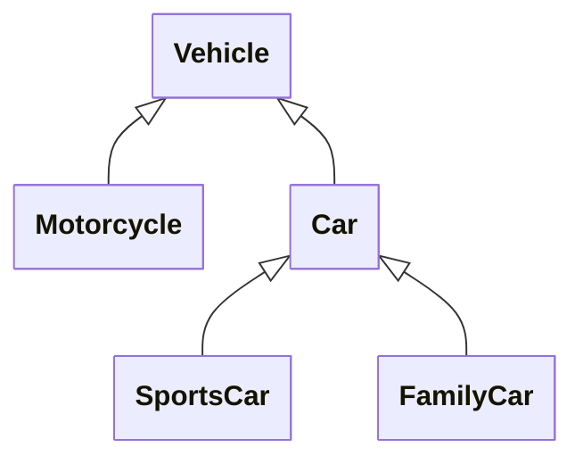
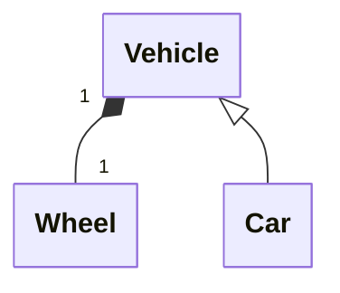

## 1. חזרה - מה זו הורשה?

{: .box-note}
**הגדרה:** הורשה (Inheritance) היא מנגנון המאפשר למחלקה חדשה לרשת תכונות והתנהגויות ממחלקה קיימת. המחלקה היורשת נקראת "מחלקת בת/נגזרת" (Derived/Child Class) והמחלקה ממנה יורשים נקראת "מחלקת אם/בסיס" (Base/Parent Class).

דמיינו עץ משפחה - ילדים יורשים תכונות מהוריהם. באופן דומה, בתכנות מונחה עצמים, מחלקות יכולות לרשת תכונות ופעולות ממחלקות אחרות.

### דוגמה

<div class="two-columns">
  <div markdown="1" class="column">
```
Vehicle
    ├── Car
    │   ├── SportsCar
    │   └── FamilyCar
    └── Motorcycle
```
  </div>
  
  <div class="column" markdown=1>

סרטוט היררכית מחלקות. המחלקות היורשות תמיד **מתחת** למחלקות הבסיס.


	
  </div>
</div>
---

## 2. עקרון IS-A - "הוא סוג של"

{: .box-success}
**כלל הזהב:** השתמשו בהורשה רק כאשר המחלקה הנגזרת **היא סוג של** המחלקה הבסיסית.

### דוגמאות נכונות ל-IS-A:
- כלב **הוא סוג של** חיה ✓
- מכונית **היא סוג של** רכב ✓
- סטודנט **הוא סוג של** אדם ✓

### דוגמאות שגויות:
- מנוע **אינו סוג של** מכונית ✗ (הוא חלק ממכונית - זו **קומפוזיציה/הכלה**). מנוע נמצא במכונית
- גלגל **אינו סוג של** מכונית ✗ (הוא רכיב במכונית). גלגל חלק ממכונית. זוהי **הכלה**, מסומנת `─♦`
- כלב אינו סוג של אדם. כלב **שייך** לאדם. זוהי **אגרגציה**.
- חתול אינו סוג של אדם. אדם **שייך** לחתול. **אגרגציה** מסומנת ב `─◇`



---


## 3. היררכיית מחלקות - תרשים היררכיה, ותרשים UML
<details open markdown=1><summary>דוגמא פשוטה: סרטוט היררכיית מחלקות</summary>
<div class=mermaid>
---
config:
    class:
        hideEmptyMembersBox: true
---

classDiagram
    direction BT
    GoldenRetriever --|> Dog
    PersianCat --|> Cat
    Dog --|> Mamal
    Cat --|> Mamal
</div>
</details>

---

<details markdown=1><summary>נוסיף גם בני אדם Human להיררכיה. נסו להרחיב ולממש דוגמא יותר מפורטת המתוארת ב-UML שלהלן</summary>
<div class=mermaid style="direction:ltr;">
---
config:
    class:
        hideEmptyMembersBox: true
---
classDiagram
    direction BT
    Human --|> Mammal
    Dog --|> Mammal
    Cat --|> Mammal
    Cat "1" *-- "*" Human : owns
    Human "0..1" *-- "*" Dog : owns
    GoldenRetriever --|> Dog
    PersianCat --|> Cat
    
    class Mammal {
        #String name
        #int age
        +ToString() String
        +Eat()
        +Sleep()
    }
    class Human {
        -Dog[] dogs
        +GetDogs() Dog[]
        +ServeCat()
    }
    class Cat {
        #Human[] controlledHumans
        +GetControlledHumans() Human[]
        +Meow()
    }
    class Dog {
        #String breed
        +Bark()
    }
    class PersianCat {
        -String furLength
    }
    class GoldenRetriever {
        -String coatColor
        +Fetch()
    }
</div>
</details>

## 4. תרגול מעשי - מימוש C#

הרחיבו את המימוש שלכם כדי שיתאים ל-UML

לרשותכם המחלקה `Mammal`. תזכורת: לכתיבת בנאי השתמשו **בקיצור ctor**

```cs
public class Mammal
{
    protected string name;
    protected int age;

    public Mammal(string name, int age)
    {
        this.name = name;
        this.age = age;
    }

    public override string ToString() => $"{name} (Age: {age})";
    public void Eat() => Console.WriteLine($"{this} is eating");
    public void Sleep() => Console.WriteLine($"{this} is sleeping");
}
```

<details markdown=1><summary>פתרון אפשרי ב- C#</summary>

```csharp


public class Dog : Mammal
{
    protected string breed;

    public Dog(string name, int age, string breed) : base(name, age)
    {
        this.breed = breed;
    }

    public void Bark() => Console.WriteLine($"{this} is barking: Woof!");
}

public class Human : Mammal
{
    private Dog[] dogs;

    public Human(string name, int age) : base(name, age)
    {
        dogs = new Dog[5];
    }

    public Dog[] GetDogs() => dogs;
    public void ServeCat() => Console.WriteLine($"{this} is serving the cat");
}

public class Cat : Mammal
{
    protected Human[] controlledHumans;

    public Cat(string name, int age) : base(name, age)
    {
        controlledHumans = new Human[10];
    }

    public Human[] GetControlledHumans() => controlledHumans;
    public void Meow() => Console.WriteLine($"{this} says: Meow!");
}

public class PersianCat : Cat
{
    private string furLength;

    public PersianCat(string name, int age, string furLength) : base(name, age)
    {
        this.furLength = furLength;
    }
}

public class GoldenRetriever : Dog
{
    private string coatColor;

    public GoldenRetriever(string name, int age, string coatColor)
        : base(name, age, "Golden Retriever")
    {
        this.coatColor = coatColor;
    }

    public void Fetch() => Console.WriteLine($"{this} is fetching the ball!");
}
```
</details>
---


<div class="box-note" markdown=1>

**סימנים ב-UML:**

**△** (משולש ריק) - מציין הורשה

**◆** (מעוין מלא) - מציין קומפוזיציה/הכלה (Composition) - "has-a" חזק

**-** מציין private

**+** מציין public

**#** מציין protected

</div>
---

## 5. שרשור בנאים (Constructor Chaining)

<div markdown=1 class="box-success" >

**חשוב לזכור:**
* כל בנאי בשרשרת מחויב להריץ קודם את הבנאי של מחלקת הבסיס שלו.
* הסדר תמיד **מלמעלה למטה** (Base → Derived), ורק לאחר סיום כל הבנאים יש לנו אובייקט מוכן לעבודה. בחירת הבנאים היא **מלמטה למעלה**
* פירוט נוסף [בתת פרק בנאים](/oop/01inheritdconstructors)

</div>

### סדר הפעלת בנאים

<div class="mermaid">
block-beta
  columns 2
  
  A0["()new GoldenRetriever"]  
  B0["אובייקט מוכן"]
  
  space:2
  
  A1["קריאה ל-<br />GoldenRetriever"]    
  B1["ביצוע<br />GoldenRetriever"] 
  
  space:2
  
  A3["קריאה ל-<br />Dog"]  
  B3["ביצוע<br />Dog"]
  
  space:2
  
  A4["קריאה ל-<br />Mammal"]   
  B4["ביצוע<br />Mammal"]

  A0 --> A1
  A1 --> A3
  A3 --> A4
  A4 --> B4
  B4 -- "חזרה ל-Dog" --> B3
  B3 -- "חזרה ל-GoldenRetriever" --> B1
  B1 --> B0

  classDef orange fill:#fff3e0,stroke:#ef6c00
  class B1 orange
  class B3 orange
  class B4 orange
  style B0 fill:#c8e6c9,stroke:#1b5e20
  style A0 fill:#e1f5fe,stroke:#0277bd
</div>

{: .box-note}
**כלל חשוב:** הבנאים נקראים מהבן לאב, אך מבוצעים מהאב לבן!


<details markdown=1><summary>דוגמאות קוד חסרות תועלת. נא להתעלם</summary>

### דוגמת קוד מפורטת
```csharp
public class Vehicle
{
    private string manufacturer;
    private int year;
    
    public Vehicle(string manufacturer, int year)
    {
        this.manufacturer = manufacturer;
        this.year = year;
        Console.WriteLine($"1. Vehicle constructor: {manufacturer}, {year}");
    }
    
    public string GetManufacturer() { return manufacturer; }
    public void SetManufacturer(string manufacturer) 
    { 
        this.manufacturer = manufacturer; 
    }
    
    public int GetYear() { return year; }
    public void SetYear(int year) 
    { 
        if (year > 1900 && year <= DateTime.Now.Year)
            this.year = year; 
    }
}

public class Car : Vehicle
{
    private int numberOfDoors;
    private string model;
    
    // בנאי עם קריאה לבנאי האב
    public Car(string manufacturer, string model, int year, int doors) 
        : base(manufacturer, year)
    {
        this.model = model;
        this.numberOfDoors = doors;
        Console.WriteLine($"2. Car constructor: {model}, {doors} doors");
    }
    
    // בנאי נוסף עם קריאה לבנאי אחר באותה מחלקה
    public Car(string manufacturer, string model) 
        : this(manufacturer, model, DateTime.Now.Year, 4)
    {
        Console.WriteLine("3. Car convenience constructor");
    }
    
    public string GetModel() { return model; }
    public void SetModel(string model) { this.model = model; }
    
    public int GetNumberOfDoors() { return numberOfDoors; }
    public void SetNumberOfDoors(int doors) 
    { 
        if (doors > 0 && doors <= 6)
            this.numberOfDoors = doors; 
    }
}

public class SportsCar : Car
{
    private int topSpeed;
    
    public SportsCar(string manufacturer, string model, int year, int topSpeed)
        : base(manufacturer, model, year, 2)  // מכונית ספורט - תמיד 2 דלתות
    {
        this.topSpeed = topSpeed;
        Console.WriteLine($"3. SportsCar constructor: Top speed {topSpeed} km/h");
    }
    
    public int GetTopSpeed() { return topSpeed; }
    public void SetTopSpeed(int speed) 
    { 
        if (speed > 0 && speed < 400)
            this.topSpeed = speed; 
    }
}
```

### הרצת הקוד והפלט
```csharp
class Program
{
    static void Main()
    {
        Console.WriteLine("Creating a SportsCar:");
        SportsCar ferrari = new SportsCar("Ferrari", "F40", 1987, 324);
        
        /* פלט:
        Creating a SportsCar:
        1. Vehicle constructor: Ferrari, 1987
        2. Car constructor: F40, 2 doors
        3. SportsCar constructor: Top speed 324 km/h
        */
    }
}
```

---

## 6x. הרחבה מעשית - מערכת ניהול עובדים

```csharp
public class Person
{
    private string id;
    private string firstName;
    private string lastName;
    private DateTime birthDate;
    
    public Person(string id, string firstName, string lastName, DateTime birthDate)
    {
        this.id = id;
        this.firstName = firstName;
        this.lastName = lastName;
        this.birthDate = birthDate;
    }
    
    // Getters and Setters
    public string GetId() { return id; }
    public string GetFirstName() { return firstName; }
    public void SetFirstName(string firstName) { this.firstName = firstName; }
    public string GetLastName() { return lastName; }
    public void SetLastName(string lastName) { this.lastName = lastName; }
    public DateTime GetBirthDate() { return birthDate; }
    
    public int GetAge()
    {
        return DateTime.Now.Year - birthDate.Year;
    }
    
    public string GetFullName()
    {
        return $"{firstName} {lastName}";
    }
}

public class Employee : Person
{
    private string employeeId;
    private decimal salary;
    private DateTime hireDate;
    
    public Employee(string id, string firstName, string lastName, 
                   DateTime birthDate, string employeeId, decimal salary)
        : base(id, firstName, lastName, birthDate)
    {
        this.employeeId = employeeId;
        this.salary = salary;
        this.hireDate = DateTime.Now;
    }
    
    public string GetEmployeeId() { return employeeId; }
    public decimal GetSalary() { return salary; }
    public void SetSalary(decimal salary) 
    { 
        if (salary > 0)
            this.salary = salary; 
    }
    
    public int GetYearsOfService()
    {
        return DateTime.Now.Year - hireDate.Year;
    }
    
    public void GiveRaise(decimal percentage)
    {
        if (percentage > 0 && percentage <= 50)
        {
            salary *= (1 + percentage / 100);
            Console.WriteLine($"{GetFullName()} received a {percentage}% raise!");
        }
    }
}

public class Manager : Employee
{
    private List<Employee> teamMembers;
    private string department;
    
    public Manager(string id, string firstName, string lastName,
                  DateTime birthDate, string employeeId, 
                  decimal salary, string department)
        : base(id, firstName, lastName, birthDate, employeeId, salary)
    {
        this.department = department;
        this.teamMembers = new List<Employee>();
    }
    
    public string GetDepartment() { return department; }
    public void SetDepartment(string department) { this.department = department; }
    
    public void AddTeamMember(Employee employee)
    {
        if (employee != null && !teamMembers.Contains(employee))
        {
            teamMembers.Add(employee);
            Console.WriteLine($"{employee.GetFullName()} added to {GetFullName()}'s team");
        }
    }
    
    public void RemoveTeamMember(Employee employee)
    {
        if (teamMembers.Remove(employee))
        {
            Console.WriteLine($"{employee.GetFullName()} removed from team");
        }
    }
    
    public int GetTeamSize()
    {
        return teamMembers.Count;
    }
    
    public void PrintTeamInfo()
    {
        Console.WriteLine($"\nManager: {GetFullName()}");
        Console.WriteLine($"Department: {department}");
        Console.WriteLine($"Team Size: {GetTeamSize()}");
        Console.WriteLine("Team Members:");
        foreach (var member in teamMembers)
        {
            Console.WriteLine($"  - {member.GetFullName()} (ID: {member.GetEmployeeId()})");
        }
    }
}
```
</details>
---

## 6. תרגול מעשי

### תרגיל 1: היררכיית כלי תחבורה
סרטטו היררכיית מחלקות (ללא קוד) עבור:
- `Vehicle` (מחלקת בסיס)
- `LandVehicle`, `WaterVehicle`, `AirVehicle` (יורשות מ-Vehicle)
- `Car`, `Bicycle` (יורשות מ-LandVehicle)
- `Boat`, `Submarine` (יורשות מ-WaterVehicle)
- `Airplane`, `Helicopter` (יורשות מ-AirVehicle)

כעת כתבו בקצרה את הקוד של מחלקות אלו (רק את הגדרות ההורשה בינהן)

### תרגיל 2: מערכת בנקאית
מַמְּשׁוּ:
- `Account` (מחלקת בסיס עם מספר חשבון ויתרה)
- `SavingsAccount` (עם ריבית)
- `CheckingAccount` (עם אפשרות למשיכת יתר)


---

## 7. סיכום ונקודות מפתח

<div class="box-success" markdown=1>

**נקודות חשובות לזכור:**
1. הורשה מאפשרת שימוש חוזר בקוד ויצירת היררכיות לוגיות
2. השתמשו בהורשה רק כאשר מתקיים יחס IS-A בין טיפוסים
3. בנאים רצים מהבסיס לנגזר (Base → Derived)
4. השתמשו ב-`base` לקריאה לבנאי או לפעולות של מחלקת האב
5. כל מחלקה ב-C# יכולה לרשת רק ממחלקה אחת (Single Inheritance)

</div>

### מה הלאה?
בשיעורים הבאים נלמד על:
- **עוד טיפה על [בנאים](/oop/01inheritdconstructors)**
- **פולימורפיזם** - איך אובייקטים שונים יכולים להתנהג בצורות שונות
    - **Virtual ו-Override** - דריסת פעולות
    - **Abstract Classes** - מחלקות מופשטות
- **Interfaces** - לא נלמד על (או שכן אבל זה לא לבגרות)

---

## 8. שאלות לתרגול עצמי

1. מהו ההבדל בין הורשה לקומפוזיציה (הכלה)?
2. מתי נשתמש בהורשה ומתי לא?
3. מה סדר הפעלת הבנאים בהיררכיית הורשה? למענה על השאלה ניתן לקרוא תחילה את [ההרחבה על בנאים](/oop/01inheritdconstructors)
4. האם מחלקה נגזרת יכולה לגשת ל-private fields של מחלקת האב?
5. מה ההבדל בין `()base` ל-`()this` בבנאים?

{: .box-note}
**להצלחה!** תרגול הוא המפתח להבנת הורשה. נסו ליצור היררכיות משלכם ולהתנסות בקוד!


[Campus playlist](https://www.youtube.com/playlist?list=PLnVUJu2KuoA0CpYg4ga45Q0C5dGaSEYPH)

[חזרה להתחלה](/oop/01inheritance)

[המשך - הרחבה בנושא בנאים](/oop/01inheritdconstructors)
