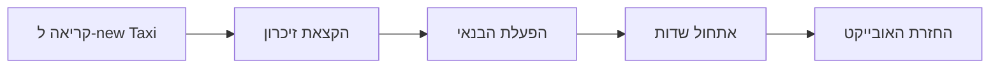
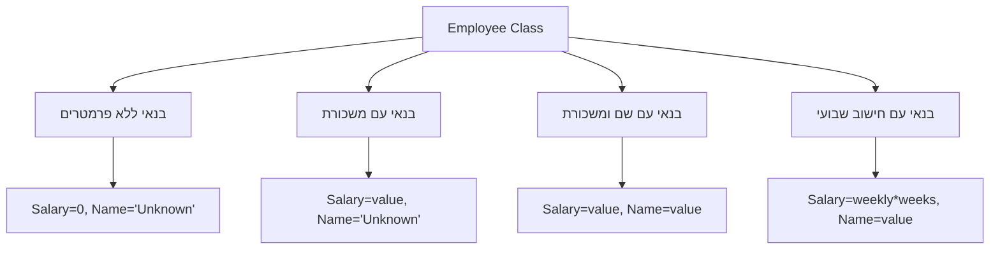
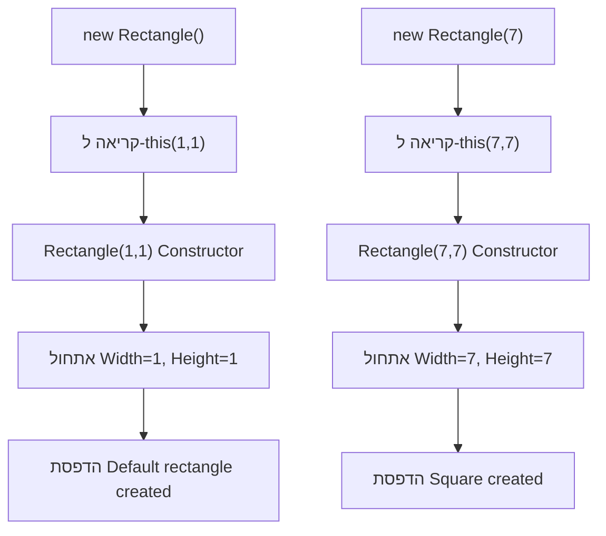

{: .box-note}
**הגדרה:** כאשר מחלקה (class) או מבנה (struct) נוצרים, הזמן ריצה (runtime) קורא לבנאי שלהם. בנאים הם מתודות מיוחדות שיש להן את אותו השם כמו המחלקה או המבנה, והן בדרך כלל מאתחלות את שדות הנתונים של האובייקט החדש.

---

## 1. בנאי בסיסי

בדוגמה הבאה, מחלקה בשם `Taxi` מוגדרת באמצעות בנאי פשוט. המחלקה נוצרת לאחר מכן באמצעות האופרטור `new`. הזמן ריצה מפעיל את הבנאי של `Taxi` מיד לאחר הקצאת זיכרון לאובייקט החדש.

```csharp
public class Taxi
{
    private string taxiTag;
    
    // בנאי עם פרמטר
    public Taxi(string tag) => taxiTag = tag;
    
    public override string ToString() => $"Taxi: {taxiTag}";
}

class TestTaxi
{
    static void Main()
    {
        Taxi t = new Taxi("Tag1345");
        Console.WriteLine(t);  // פלט: Taxi: Tag1345
    }
}
```



---

## 2. בנאי ללא פרמטרים (Parameterless Constructor)

{: .box-success}
**חשוב:** בנאי שלא מקבל פרמטרים נקרא "בנאי ללא פרמטרים". הזמן ריצה מפעיל אותו כאשר אובייקט נוצר באמצעות `new` ללא ארגומנטים.

### בנאי ברירת מחדל
אם לא מגדירים בנאי במחלקה, המהדר של C# יוצר אוטומטית בנאי ציבורי ללא פרמטרים:

```csharp
public class Car
{
    private string model;
    private int year;
    
    // המהדר יוצר אוטומטית:
    // public Car() { }
    
    // Getters and Setters - Java Style
    public string GetModel() { return model; }
    public void SetModel(string model) { this.model = model; }
    
    public int GetYear() { return year; }
    public void SetYear(int year) { this.year = year; }
}

// שימוש
Car myCar = new Car();  // עובד בגלל הבנאי האוטומטי
myCar.SetModel("Toyota");
myCar.SetYear(2024);
```

---

## 3. מניעת יצירת מופעים - Private Constructor

ניתן למנוע יצירת מופעים של מחלקה על ידי הפיכת הבנאי לפרטי:

```csharp
class NLog
{
    // בנאי פרטי - מונע יצירת אובייקטים
    private NLog() { }
    
    // משתנה סטטי ציבורי
    public static double e = Math.E;  // 2.71828...
}

// שימוש
// NLog log = new NLog();  // שגיאת קומפילציה!
double value = NLog.e;     // עובד - גישה לשדה סטטי
```

{: .box-note}
**שימושים נפוצים לבנאי פרטי:**
- מחלקות Singleton
- מחלקות עזר סטטיות (Utility Classes)
- מחלקות Factory

---

## 4. בנאים במבנים (Structs)

בנאים עבור מבנים דומים לבנאי מחלקות, עם כמה הבדלים חשובים:

```csharp
public struct Point
{
    private int x;
    private int y;
    
    // בנאי עם פרמטרים
    public Point(int x, int y)
    {
        this.x = x;
        this.y = y;
    }
    
    // Getters and Setters
    public int GetX() { return x; }
    public void SetX(int x) { this.x = x; }
    
    public int GetY() { return y; }
    public void SetY(int y) { this.y = y; }
}

// דרכים שונות לאתחל struct
Point p1 = new Point();        // x=0, y=0 (ערכי ברירת מחדל)
Point p2 = new Point(10, 20);  // x=10, y=20
Point p3 = default;             // x=0, y=0
```

### אתחול מספרים שלמים
```csharp
// שימוש בבנאי ללא פרמטרים של Int32
int i = new int();  // i = 0
Console.WriteLine(i);

// אתחול ישיר
int a = 44;
int b;
b = 33;  // הקצאה לפני השימוש
Console.WriteLine($"{a}, {b}");  // 44, 33
```

---

## 5. ריבוי בנאים (Constructor Overloading)

מחלקות ומבנים יכולים להגדיר מספר בנאים עם חתימות שונות:

```csharp
public class Employee
{
    private int salary;
    private string name;
    
    // בנאי ללא פרמטרים
    public Employee() 
    { 
        salary = 0;
        name = "Unknown";
    }
    
    // בנאי עם פרמטר אחד
    public Employee(int annualSalary) 
    {
        salary = annualSalary;
        name = "Unknown";
    }
    
    // בנאי עם שני פרמטרים
    public Employee(string name, int annualSalary)
    {
        this.name = name;
        this.salary = annualSalary;
    }
    
    // בנאי שמחשב משכורת שנתית
    public Employee(string name, int weeklySalary, int numberOfWeeks)
    {
        this.name = name;
        this.salary = weeklySalary * numberOfWeeks;
    }
    
    // Getters and Setters - Java Style
    public int GetSalary() { return salary; }
    public void SetSalary(int salary) { this.salary = salary; }
    
    public string GetName() { return name; }
    public void SetName(string name) { this.name = name; }
}
```

### שימוש בבנאים השונים:
```csharp
Employee e1 = new Employee();                      // ברירת מחדל
Employee e2 = new Employee(30000);                 // משכורת בלבד
Employee e3 = new Employee("John", 50000);         // שם ומשכורת
Employee e4 = new Employee("Jane", 1000, 52);      // חישוב שנתי
```



---

## 6. שרשור בנאים עם base

בנאי יכול להשתמש במילת המפתח `base` כדי לקרוא לבנאי של מחלקת הבסיס:

```csharp
public class Manager : Employee
{
    private string department;
    
    public Manager(string name, int annualSalary, string department)
        : base(name, annualSalary)  // קריאה לבנאי של Employee
    {
        this.department = department;
        // הוראות נוספות כאן
    }
    
    // Getter and Setter for department
    public string GetDepartment() { return department; }
    public void SetDepartment(string department) { this.department = department; }
}
```

{: .box-success}
**כלל חשוב:** הבנאי של מחלקת הבסיס נקרא **לפני** שהבלוק של הבנאי הנגזר מתבצע!

### קריאה משתמעת לבנאי הבסיס
אם לא מציינים קריאה מפורשת עם `base`, הבנאי ללא פרמטרים של מחלקת הבסיס נקרא אוטומטית:

```csharp
// שתי ההגדרות הבאות זהות:
public Manager(int initialData)
{
    // קריאה אוטומטית ל-base()
}

public Manager(int initialData)
    : base()  // קריאה מפורשת
{
}
```

{: .box-note}
**אזהרה:** אם למחלקת הבסיס אין בנאי ללא פרמטרים, חובה לקרוא לבנאי עם `base` באופן מפורש!

---

## 7. שרשור בנאים עם this

בנאי יכול לקרוא לבנאי אחר באותה מחלקה באמצעות `this`:

```csharp
public class Rectangle
{
    private int width;
    private int height;
    
    // בנאי ראשי
    public Rectangle(int width, int height)
    {
        this.width = width;
        this.height = height;
        Console.WriteLine($"Rectangle created: {width}x{height}");
    }
    
    // בנאי לריבוע - קורא לבנאי הראשי
    public Rectangle(int size)
        : this(size, size)
    {
        Console.WriteLine("Square created");
    }
    
    // בנאי ברירת מחדל
    public Rectangle()
        : this(1, 1)
    {
        Console.WriteLine("Default rectangle created");
    }
    
    // Getters and Setters - Java Style
    public int GetWidth() { return width; }
    public void SetWidth(int width) { this.width = width; }
    
    public int GetHeight() { return height; }
    public void SetHeight(int height) { this.height = height; }
}
```

### דוגמה לשימוש:
```csharp
Rectangle r1 = new Rectangle(5, 10);  // Rectangle created: 5x10
Rectangle r2 = new Rectangle(7);      // Rectangle created: 7x7, Square created
Rectangle r3 = new Rectangle();       // Rectangle created: 1x1, Default rectangle created
```



---

## 8. מתאמי גישה לבנאים

בנאים יכולים להיות מוגדרים עם מתאמי גישה שונים:

```csharp
public class DatabaseConnection
{
    // בנאי ציבורי - נגיש מכל מקום
    public DatabaseConnection(string connectionString)
    {
        // אתחול חיבור
    }
    
    // בנאי מוגן - נגיש רק למחלקות יורשות
    protected DatabaseConnection()
    {
        // בנאי למחלקות נגזרות
    }
    
    // בנאי פנימי - נגיש רק באותו Assembly
    internal DatabaseConnection(int timeout)
    {
        // בנאי לשימוש פנימי
    }
    
    // בנאי פרטי - לשימוש פנימי במחלקה בלבד
    private DatabaseConnection(bool isTest)
    {
        // בנאי לבדיקות
    }
}
```

{: .box-note}
**מתאמי גישה נפוצים:**
- `public` - נגיש מכל מקום
- `private` - נגיש רק בתוך המחלקה
- `protected` - נגיש למחלקה ולמחלקות יורשות
- `internal` - נגיש באותו Assembly
- `protected internal` - נגיש באותו Assembly או למחלקות יורשות
- `private protected` - נגיש למחלקות יורשות באותו Assembly

---

## 9. בנאים סטטיים (Static Constructors)

בנאי סטטי נקרא אוטומטית לפני הגישה הראשונה לשדות סטטיים של המחלקה:

```csharp
public class Configuration
{
    private static string connectionString;
    private static int maxConnections;
    
    // בנאי סטטי - נקרא פעם אחת בלבד
    static Configuration()
    {
        Console.WriteLine("Loading configuration...");
        connectionString = LoadFromFile("connection");
        maxConnections = 100;
    }
    
    private static string LoadFromFile(string key)
    {
        // סימולציה של טעינה מקובץ
        return "Server=localhost;Database=MyDB";
    }
    
    // Static Getters - Java Style
    public static string GetConnectionString() { return connectionString; }
    public static int GetMaxConnections() { return maxConnections; }
}

// שימוש
string conn = Configuration.GetConnectionString();  // הבנאי הסטטי נקרא כאן
int max = Configuration.GetMaxConnections();        // הבנאי כבר רץ, לא נקרא שוב
```

{: .box-success}
**מאפייני בנאי סטטי:**
- אין לו מתאם גישה
- אין לו פרמטרים
- נקרא אוטומטית לפני השימוש הראשון במחלקה
- נקרא פעם אחת בלבד
- לא ניתן לקרוא לו ישירות

---

## 10. דוגמה מקיפה - מערכת בנקאית

```csharp
public abstract class Account
{
    private static int nextAccountNumber = 1000;
    
    private int accountNumber;
    private string owner;
    protected decimal balance;  // protected כדי שמחלקות נגזרות יוכלו לגשת
    private DateTime createdDate;
    
    // בנאי סטטי - אתחול מונה חשבונות
    static Account()
    {
        Console.WriteLine("Banking system initialized");
        // ניתן לטעון את המספר האחרון מבסיס נתונים
    }
    
    // בנאי מוגן למחלקות נגזרות
    protected Account(string owner, decimal initialBalance)
    {
        if (string.IsNullOrEmpty(owner))
            throw new ArgumentException("Owner name is required");
            
        if (initialBalance < 0)
            throw new ArgumentException("Initial balance cannot be negative");
            
        accountNumber = nextAccountNumber++;
        this.owner = owner;
        this.balance = initialBalance;
        this.createdDate = DateTime.Now;
        
        Console.WriteLine($"Account #{accountNumber} created for {owner}");
    }
    
    // Getters - Java Style
    public int GetAccountNumber() { return accountNumber; }
    public string GetOwner() { return owner; }
    public decimal GetBalance() { return balance; }
    public DateTime GetCreatedDate() { return createdDate; }
    
    // Protected setter for balance - למחלקות נגזרות
    protected void SetBalance(decimal balance) { this.balance = balance; }
}

public class SavingsAccount : Account
{
    private decimal interestRate;
    
    // שרשור לבנאי הבסיס
    public SavingsAccount(string owner, decimal initialBalance, decimal interestRate)
        : base(owner, initialBalance)
    {
        if (interestRate < 0 || interestRate > 0.1m)
            throw new ArgumentException("Invalid interest rate");
            
        this.interestRate = interestRate;
        Console.WriteLine($"Savings account with {interestRate:P} interest");
    }
    
    // בנאי נוחות עם ריבית ברירת מחדל
    public SavingsAccount(string owner, decimal initialBalance)
        : this(owner, initialBalance, 0.02m)  // 2% ברירת מחדל
    {
    }
    
    // Getters and Setters
    public decimal GetInterestRate() { return interestRate; }
    public void SetInterestRate(decimal rate) 
    { 
        if (rate >= 0 && rate <= 0.1m)
            this.interestRate = rate; 
    }
}

public class CheckingAccount : Account
{
    private decimal overdraftLimit;
    
    public CheckingAccount(string owner, decimal initialBalance, decimal overdraftLimit)
        : base(owner, initialBalance)
    {
        if (overdraftLimit < 0)
            throw new ArgumentException("Overdraft limit cannot be negative");
            
        this.overdraftLimit = overdraftLimit;
        Console.WriteLine($"Checking account with ${overdraftLimit} overdraft");
    }
    
    // בנאי ללא אוברדרפט
    public CheckingAccount(string owner, decimal initialBalance)
        : this(owner, initialBalance, 0)
    {
    }
    
    // Getters and Setters
    public decimal GetOverdraftLimit() { return overdraftLimit; }
    public void SetOverdraftLimit(decimal limit) 
    { 
        if (limit >= 0)
            this.overdraftLimit = limit; 
    }
}

// שימוש
class BankingApp
{
    static void Main()
    {
        var savings = new SavingsAccount("Alice", 1000);
        var checking = new CheckingAccount("Bob", 500, 200);
        var vipSavings = new SavingsAccount("Charlie", 10000, 0.05m);
        
        // שימוש ב-Getters
        Console.WriteLine($"Alice's balance: ${savings.GetBalance()}");
        Console.WriteLine($"Bob's overdraft: ${checking.GetOverdraftLimit()}");
        Console.WriteLine($"Charlie's interest rate: {vipSavings.GetInterestRate():P}");
        
        /* פלט:
        Banking system initialized
        Account #1000 created for Alice
        Savings account with 2.00% interest
        Account #1001 created for Bob
        Checking account with $200 overdraft
        Account #1002 created for Charlie
        Savings account with 5.00% interest
        Alice's balance: $1000
        Bob's overdraft: $200
        Charlie's interest rate: 5.00%
        */
    }
}
```

---

## סיכום

{: .box-success}
**נקודות מפתח לזכור:**
1. בנאים נקראים אוטומטית בעת יצירת אובייקט עם `new`
2. אם לא מגדירים בנאי, המהדר יוצר בנאי ללא פרמטרים
3. ניתן להגדיר מספר בנאים עם חתימות שונות (Overloading)
4. השתמשו ב-`base` לקריאה לבנאי מחלקת הבסיס
5. השתמשו ב-`this` לקריאה לבנאי אחר באותה מחלקה
6. בנאים סטטיים מאתחלים את המחלקה פעם אחת בלבד
7. בנאים פרטיים מונעים יצירת מופעים של המחלקה

{: .box-note}
**טיפ:** תמיד אתחלו את כל השדות בבנאי כדי למנוע מצבים לא מוגדרים!