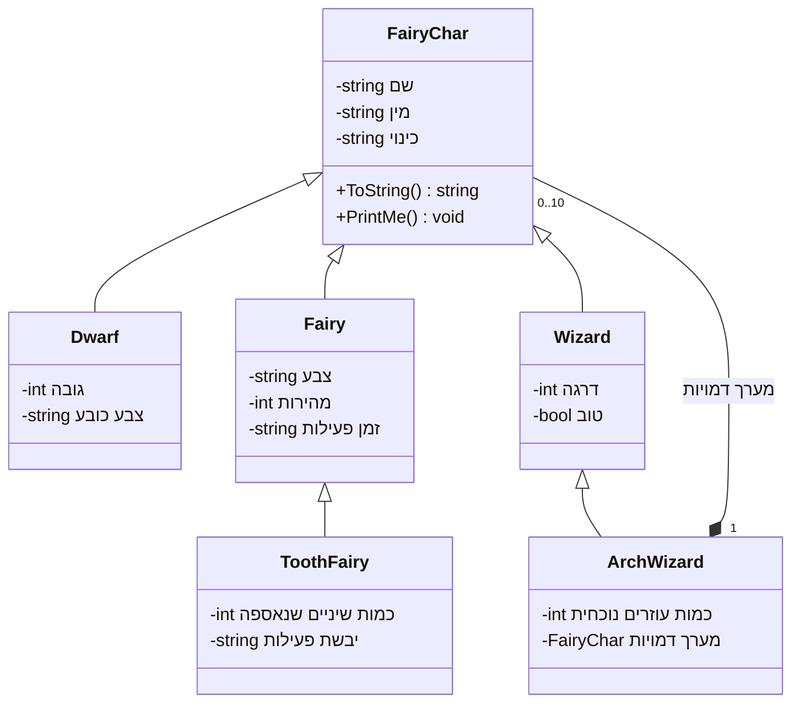

---

{: .alefbet}

1. ממשו בשפת תכנות את המחלקות השונות ב-UML (תרשים העצמים).  
   * יש להגדיר לכל מחלקה את תכונותיה, קשרי ההורשה, פעולות בונות, מאחזרות וקובעות ו־ToString().  
   * יש להוסיף למחלקות השונות את הפעולה ToString() שתחזיר מחרוזת המכילה את שם המחלקה והכינוי של הדמות. פעולה זו במחלקת "קוסם על" תציג גם את כינוי כל העוזרים של קוסם העל.

2. ממשו את הפעולה בכל המחלקות היורשות כך ששם המחלקה שיוחזר במחרוזת יהיה שם המחלקה הבן הממומש ביותר בתרשים העצמים, הרלוונטי לעצם עליו מופעלת הפעולה.

3. כתבו פעולה ראשית אשר יוצרת רשימה (שרשרת חוליות) של דמויות מן האגדות שתכיל:  
   א. 2 פיות, מתוכן 2 פיות שיניים.  
   ב. 5 גמדים.  
   ג. 3 קוסמים, מתוכם קוסם על יחיד אשר יש לו 3 עוזרים: פיית שיניים אחת ו־2 גמדים מן הדמויות שיצרת לעיל.  
   ד. עדכנו את כינויו של קוסם העל ל־"Gandalf the white".  
   ה. הגדילו את כמות השיניים שנאספה לפיית השיניים ב־5.  
   ו. סרקו את הרשימה והדפיסו את תוצאות הפעולה ToString() על כל אחד מהדמויות ברשימה.  
   ז. פיות השיניים עשו עבודה נהדרת השנה, ברצונכם להודות להן. סרקו את הרשימה והדפיסו רק את השמות של פיות השיניים ולצידן המילה Thanks.

4. בצעו מעקב עצמי מלא אחר התוכנית הראשית.
